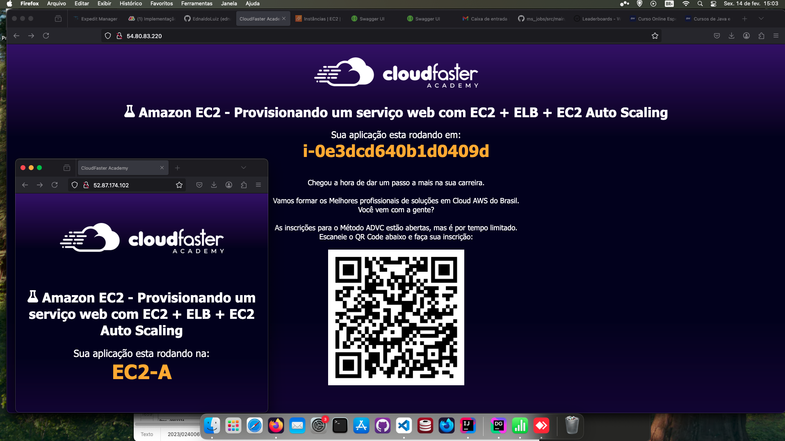
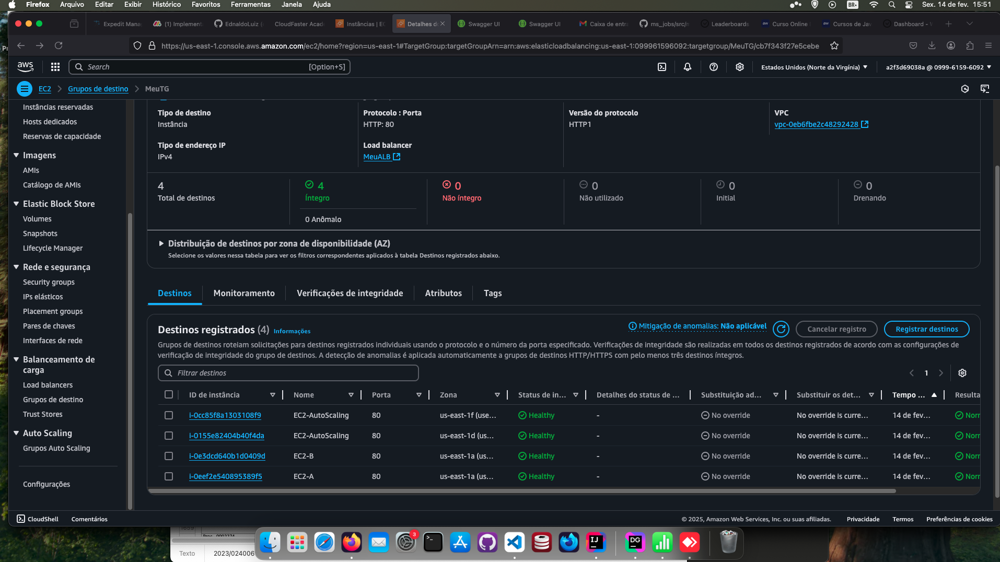
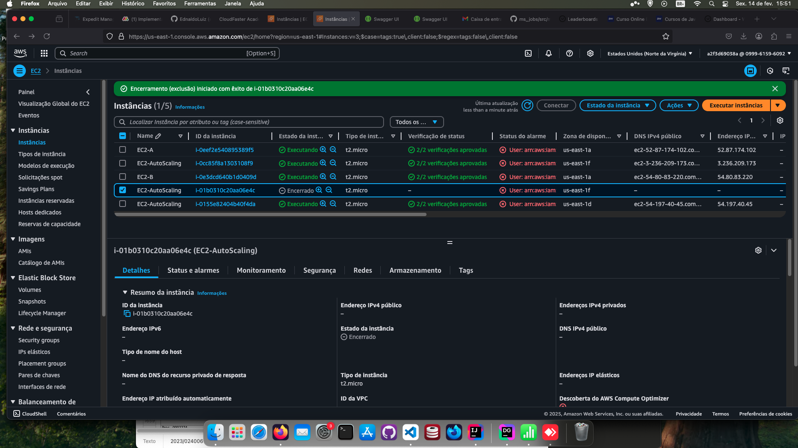

<h1 align=center> Amazon EC2 - Provisionando um serviço web com EC2 + ELB + EC2 Auto Scaling</h1>

<h2>Arquitetura do laboratório</h2>

    

<h2> Conteúdo do laboratório </h2>

Neste laboratório você irá implementar na prática os conceitos de como subir um servidor web, balanceamento de cargas e de auto scaling.

<h2>Tarefas a serem executadas</h2>

1. Faça login na AWS.
2. Crie as instâncias EC2 A e EC2 B.
3. Verifique as EC2 criadas.
4. Crie um Target Group.
5. Crie um Application Load Balancer (ALB).
6. Crie um Modelo de Execução para o Auto Scaling Group (ASG).
7. Crie um Launch template (Modelo de execução).
8. Crie um Auto Scaling Group (ASG).
9. Teste o Auto Scaling Group (ASG), o Target Group e seu Elastic Load Balancer.

<h2>Resultado</h2>

    

    

    

