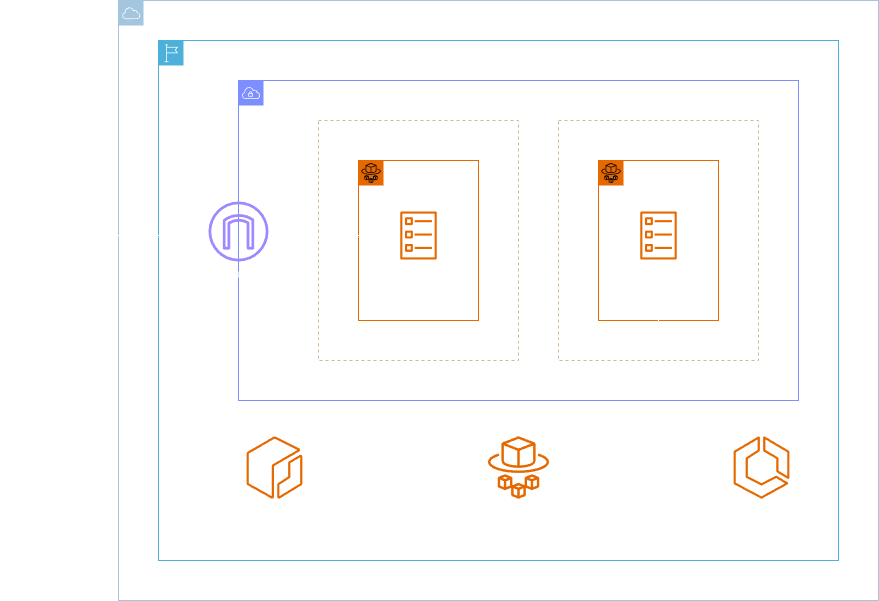

<h1 align=center> Amazon ECS - Provisionando uma aplicação web com ECS + Fargate </h1>

    

<h2> Amazon Elastic Container Service (ECS) </h2>

Amazon Elastic Container Service (ECS) é um serviço de orquestração de contêineres totalmente gerenciado que simplifica o processo de implementação, gerenciamento e escalabilidade de aplicativos contêinerizados. Com o ECS, os desenvolvedores podem concentrar-se no desenvolvimento de aplicativos, enquanto o serviço cuida da infraestrutura subjacente, permitindo uma execução eficiente e escalável de contêineres. Ele integra-se perfeitamente com outros serviços da AWS, oferecendo flexibilidade e escalabilidade para ambientes contêinerizados, seja utilizando EC2 ou Fargate para a execução dos contêineres.

<h2> AWS Fargate </h2>

AWS Fargate é um serviço de computação serverless para contêineres que permite executar aplicativos contêinerizados sem a necessidade de gerenciar a infraestrutura subjacente. Com o Fargate, os usuários podem focar na criação e execução de contêineres, enquanto a AWS lida automaticamente com a alocação de recursos, escalabilidade e otimização do ambiente de execução. Ele oferece uma abordagem simplificada para implantar e gerenciar contêineres, eliminando a necessidade de configurar e gerenciar instâncias EC2. O Fargate é altamente integrado com o ecossistema AWS, proporcionando flexibilidade e eficiência na execução de cargas de trabalho contêinerizadas.

<h2> Conteúdo do laboratório </h2>

Neste laboratório você aprenderá criar um Dockerfile, a realizar o build de uma imagem usando o Docker, a criar um repositório de imagens no Amazon ECR e a provisionar um ambiente utilizando o Amazon ECS com Fargate. 

<h2>Tarefas a serem executadas</h2>

1. Configure um Dockerfile.
2. Faça o build da imagem Docker.
3. Crie um repositório no Amazon ECR.
4. Faça o upload da imagem Docker para o Amazon ECR.
5. Crie um novo grupo de segurança.
6. Crie o cluster de ECS.
7. Crie uma Task Definition para o ECS.
8. Rode a task de forma manual e valide o acesso.
9. Rode a task de forma automática criando um serviço.
10. Verifique a task iniciada automaticamente.

<h2>Resultado</h2>

    

    

