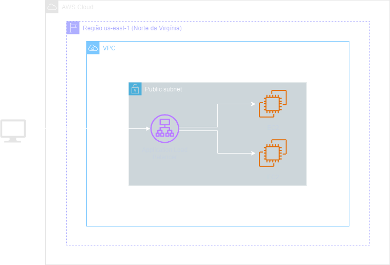
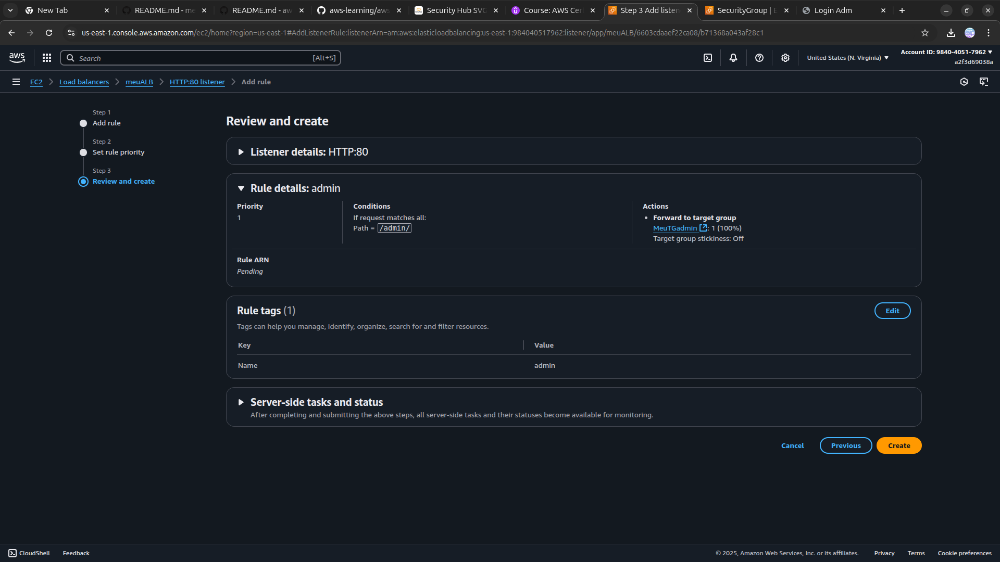
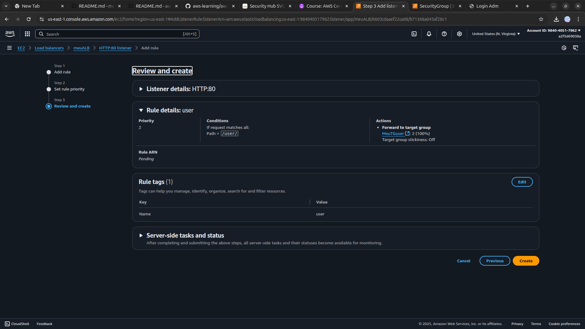

<h1 align=center> Amazon Elastic Load Balancer - Criando e configurando um Network Load Balancer </h1>

    

<h2> Amazon Elastic Load Balancer (ELB) </h2>

O Amazon Elastic Load Balancer (ELB) é um serviço projetado para distribuir automaticamente o tráfego de rede de aplicativos entre várias instâncias de servidores, melhorando assim a escalabilidade e a disponibilidade. O ELB oferece suporte a três tipos de balanceadores de carga, permitindo a escolha do mais adequado de acordo com as necessidades da aplicação. Recomenda-se o uso do balanceador de carga da aplicação (ALB) para equilibrar a carga de solicitações HTTP, o balanceador de carga da rede para protocolos de rede/transporte (camada 4: TCP, UDP) e para aplicações com requisitos de desempenho e baixa latência, e o balanceador de carga clássico para aplicações na rede Amazon Elastic Compute Cloud (Amazon EC2) Classic. O balanceador de carga de gateway é sugerido para implementar e executar dispositivos virtuais de terceiros. Neste laboratório, optaremos pelo uso do ALB para realizar o roteamento personalizado baseado em caminho.

<h2> Conteúdo do laboratório </h2>

Neste laboratório você irá aprender a criar duas instâncias EC2 em um subnet púlblica e a implementação de rotas personalizadas em um (ALB), configurando seu ALB e adicionando o  roteamento baseado em caminhos para otimizar o direcionamento do tráfego.

<h2>Tarefas a serem executadas</h2>

1. Fazer login na console da AWS.
2. Iniciar instâncias EC2 com script bash.
3. Criar grupos de destino (target group).
4. Criar um application load balancer.
5. Realizar configurações avançadas de regras de roteamento de solicitação.
6. Realizar teste de configuração do ELB.

<h2>Resultado</h2>

    

    

