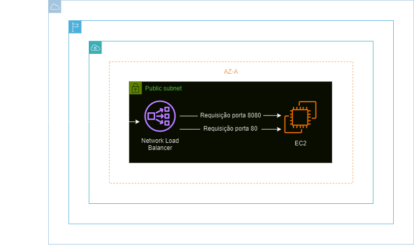
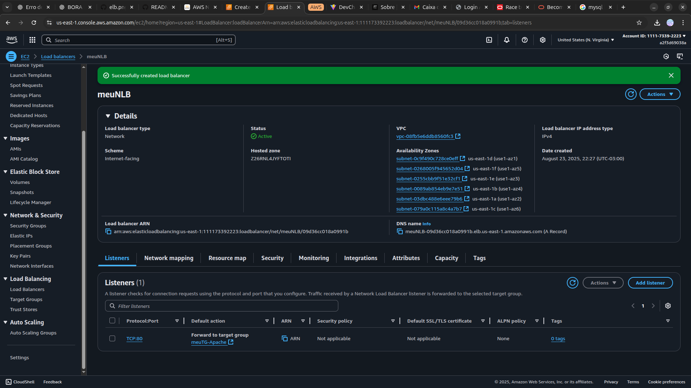
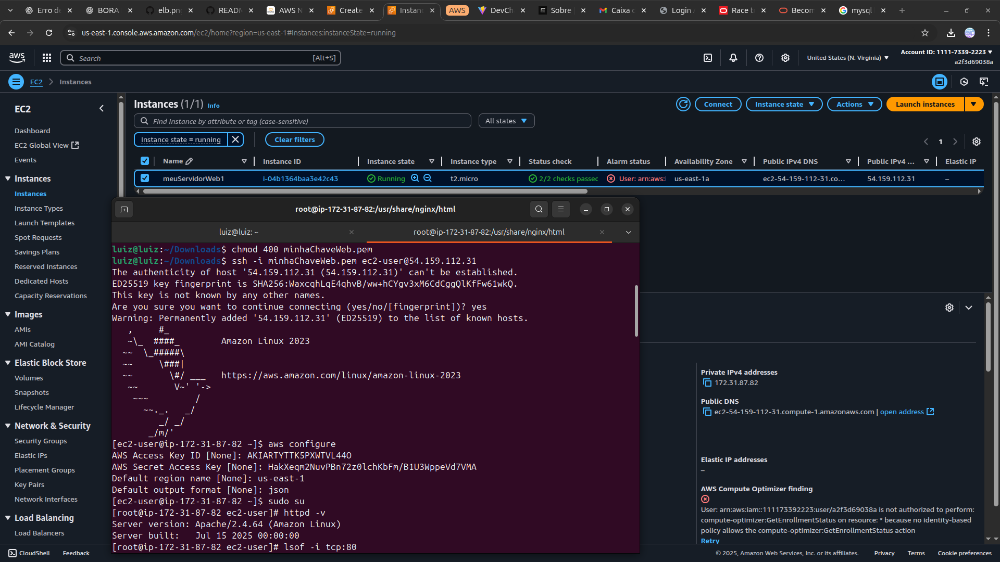

<h1 align=center> Amazon Elastic Load Balancer - Criando e configurando um Network Load Balancer </h1>

    

<h2> Network Load Balancer </h2>

O Network Load Balancer (NLB) da AWS é um serviço altamente disponível e dimensionável projetado para distribuir automaticamente seu tráfego de entrada entre vários destinos, como instâncias do EC2, contêineres e endereços IP, em uma ou mais zonas de disponibilidade.

Ele opera no nível da camada de transporte (TCP/UDP), proporcionando baixa latência e alto desempenho, sendo ideal para cargas de trabalho que exigem manipulação de milhões de solicitações por segundo. O NLB oferece recursos como escalabilidade automática, suporte a IP fixo e integração com o Amazon Route 53, para proporcionar uma solução robusta para balanceamento de carga, em ambientes de nuvem. O NLB é uma ótima escolha para garantir a disponibilidade e confiabilidade de aplicações distribuídas.

<h2> Conteúdo do laboratório </h2>

Neste laboratório, você aprenderá a criar uma instância EC2 realizando a instalação de servidores Apache e Nginx. Além disso, utilizamos um Network Load Balancer (NLB) para direcionar o tráfego, encaminhando as solicitações na porta 80 para o Apache e na porta 8080 para o Nginx.

<h2>Tarefas a serem executadas</h2>

1. Acesse a console de gerenciamento da AWS.
2. Inicie a instância EC2.
3. Crie um Network Load Balancer.
4. Crie um Grupo de Destino para Nginx.
5. Adicione um ouvinte (listener) no NLB para Nginx na porta 8080.
6. Instale e configure o Nginx.
7. Teste o Network Load Balancer.

<h2>Resultado</h2>

    

    

