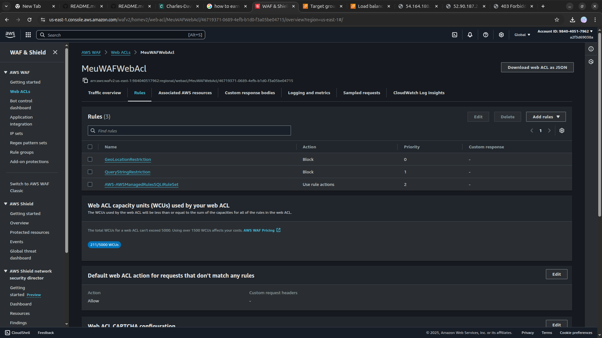
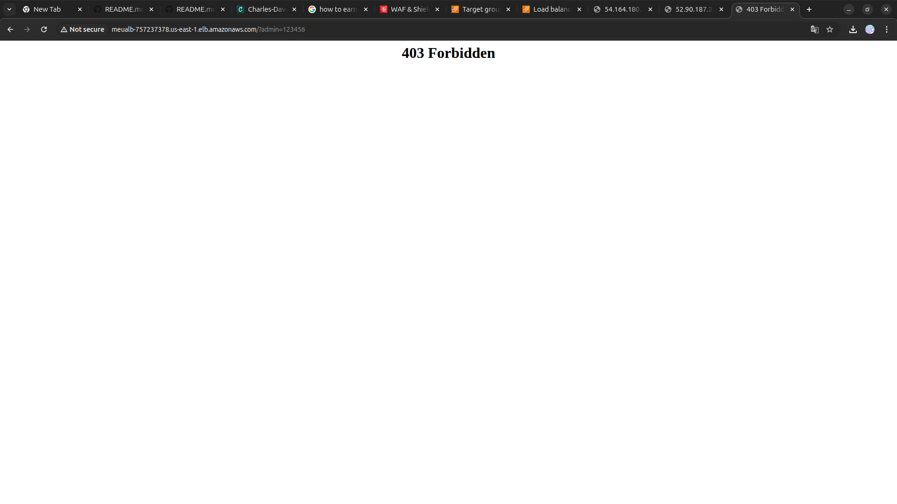

<h1 align=center> AWS WAF - Criando regras e aplicando segurança no ALB (Application Load Balancer) </h1>

    

<h2> AWS WAF (Web Application Firewall) </h2>

O AWS WAF é um serviço de segurança altamente escalável oferecido pela Amazon Web Services (AWS) que protege aplicações web contra ameaças online. Projetado para proteger contra ataques comuns, como injeções SQL, cross-site scripting (XSS) e outros tipos de exploração de vulnerabilidades, o AWS WAF permite que os usuários configurem regras personalizadas para filtrar e bloquear tráfego malicioso antes que atinja suas aplicações. Integrado de forma transparente com outros serviços da AWS, o WAF oferece flexibilidade e controle, permitindo que as organizações protejam suas aplicações web de maneira eficaz, mantendo a disponibilidade e o desempenho. Com recursos como listas GeoIP, proteção contra bots e integração com a AWS CloudWatch para monitoramento em tempo real, o AWS WAF é uma ferramenta essencial para fortalecer a postura de segurança das aplicações hospedadas na infraestrutura da AWS.

<h2> Conteúdo do laboratório </h2>

Neste laboratório, você aprenderá a criar duas instâncias EC2 em uma subnet pública e a implementar um (ALB), configurando um WAF na frente do ALB para proteger suas aplicações web. Isso incluirá a adição de regras para bloquear solicitações de um país ou geolocalização específica, bem como para prevenir injeções de SQL e manipulações de Query String.

<h2>Tarefas a serem executadas</h2>

1. Faça login na console de gerenciamento.
2. Inicie instâncias EC2 com script Bash.
3. Crie um Application Load Balancer.
4. Teste o DNS do balanceador de carga.
5. Crie um web ACL do AWS WAF.
6. Teste o DNS do balanceador de carga.

<h2>Resultado</h2>

    

    

    

