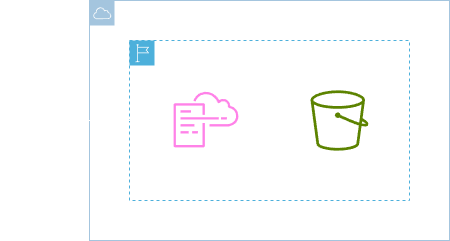
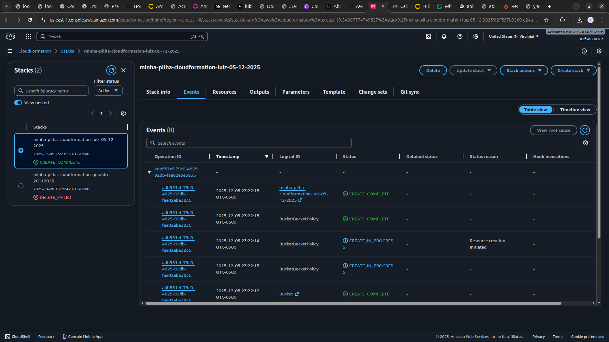
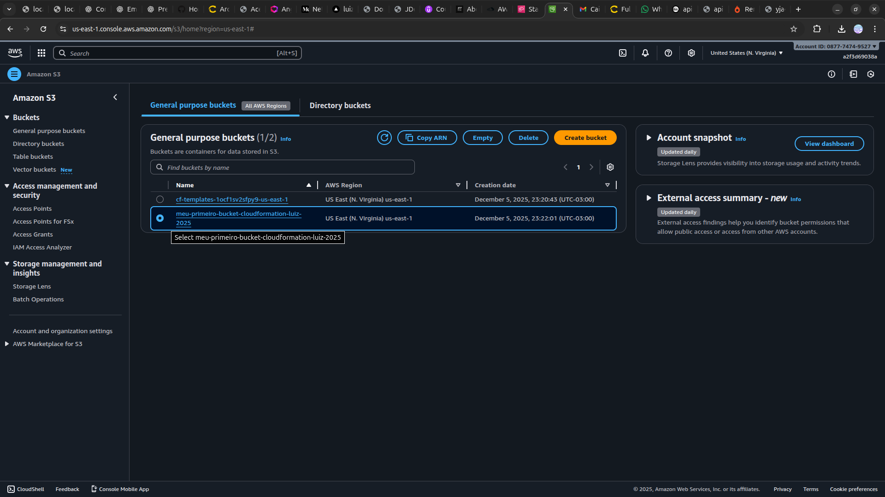

<h1 align=center> AWS CloudFormation - Criando um bucket S3 com AWS CloudFormation </h1>

    

<h2> AWS CloudFormation </h2>

O AWS CloudFormation é um serviço da Amazon Web Services que facilita o provisionamento e a gestão de recursos de infraestrutura na nuvem, através de templates definidos por código. Com o CloudFormation, os usuários podem modelar e configurar toda a sua infraestrutura AWS utilizando arquivos de texto, como JSON ou YAML, permitindo a automação de processos complexos e a replicação de ambientes com precisão e consistência.

Isso promove a implementação de práticas de infraestrutura como código (IaC), facilitando o controle de versões, a revisão de mudanças e a implementação de práticas DevOps. Além disso, ao utilizar o CloudFormation, as empresas podem reduzir o tempo de configuração, minimizar erros humanos e garantir a conformidade e governança de suas arquiteturas de TI, otimizando a eficiência operacional e acelerando o desenvolvimento de aplicações.

<h2> Conteúdo do laboratório </h2>

O Objetivo deste laboratório é gerar um bucket S3 com nome personalizado, através do serviço da AWS chamado AWS CloudFormation. Para isso, vamos utilizar a console e aprender como pode ser fácil construir recursos utilizando ferramentas visuais e código, para gerar nossos recursos na AWS.

<h2>Tarefas a serem executadas</h2>

1. Acesse a console de gerenciamento da AWS.
2. Crie um bucket utilizando CloudFormation.
3. Verifique a criação do bucket S3.

<h2>Resultado</h2>

    

    

