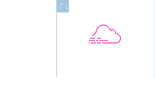
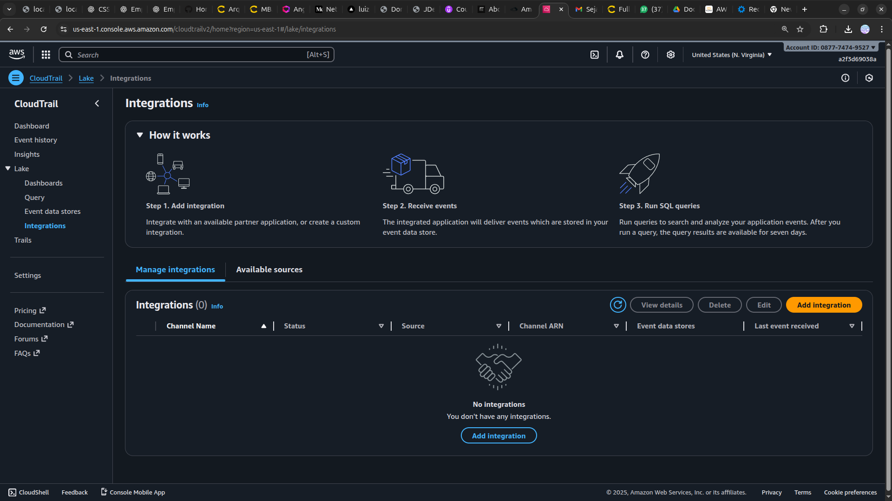

<h1 align=center> Amazon CloudTrail - Conhecendo o painel do Amazon CloudTrail </h1>

    

<h2> Amazon CloudTrail </h2>

O Amazon CloudTrail é um serviço fundamental para quem utiliza a infraestrutura da Amazon Web Services (AWS). Ele oferece uma trilha de auditoria detalhada de todas as interações e ações realizadas em uma conta da AWS. Desde acessos ao console até chamadas de API e alterações de configuração, o CloudTrail registra cada movimento, permitindo uma visão transparente e segura das operações. Esses registros são armazenados de forma duradoura, facilitando auditorias de conformidade, investigações de segurança e monitoramento contínuo. Com o CloudTrail, a segurança da conta e dos dados é aprimorada, proporcionando tranquilidade e controle aos usuários da AWS.

<h2> Conteúdo do laboratório </h2>

O objetivo deste laboratório é conhecer a console do Amazon CloudTrail e suas funcionalidades.

<h2>Tarefas a serem executadas</h2>

1. Faça login na console de gerenciamento da AWS.
2. Conheça a console do Amazon CloudTrail.

<h2>Resultado</h2>

    

