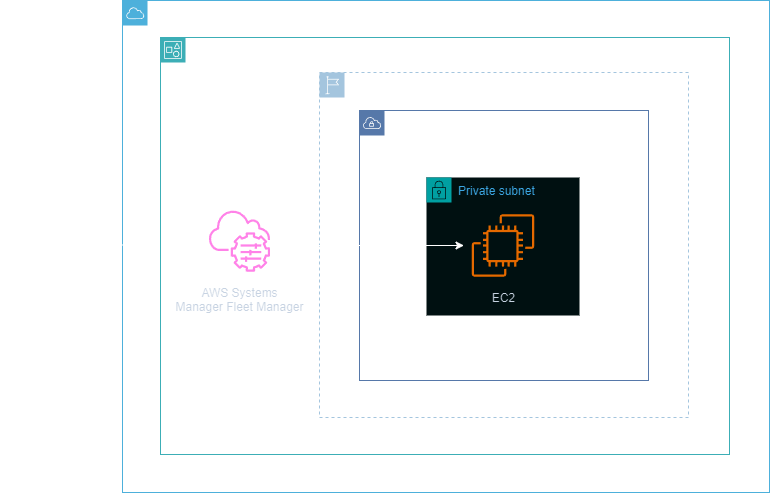
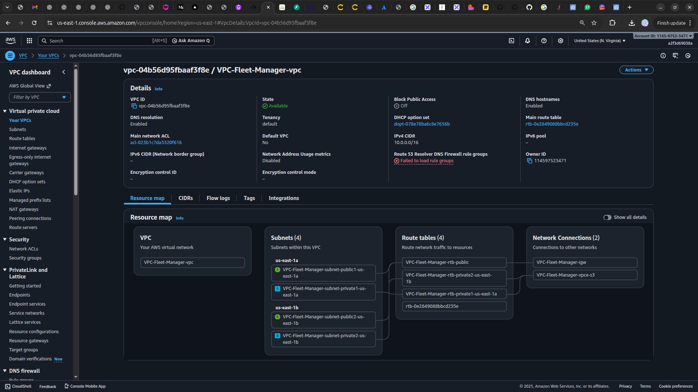
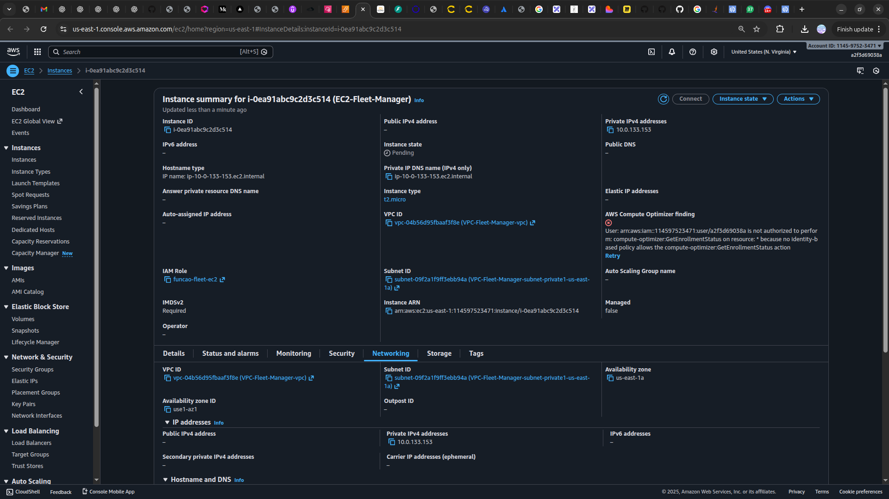
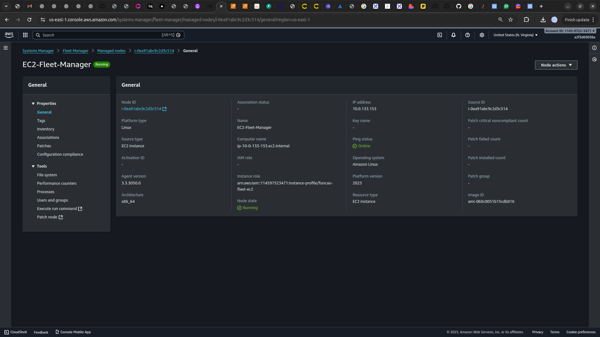

<h1 align=center> AWS Systems Manager - Acessando uma EC2 Linux via Fleet Manager </h1>

    

<h2> AWS System Manager Fleet Manager </h2>

O Fleet Manager, um recurso do AWS Systems Manager, é uma experiência de interface de usuário unificada (UI) que ajuda você a gerenciar remotamente os nós em execução na AWS ou on-premises. Com Fleet Manager, você pode visualizar o status de integridade e a performance de toda a sua frota de servidores em uma console. Você também pode coletar dados de nós individuais para executar tarefas comuns de solução de problemas e gerenciamento. Com o Fleet Manager, os usuários podem centralizar e visualizar informações críticas sobre suas instâncias, facilitando a tomada de decisões informadas. O Fleet Manager oferece uma administração segura e simplificada de ambientes na nuvem da AWS.

<h2> Conteúdo do laboratório </h2>

Neste laboratório, aprenderemos a criar uma VPC e a implementar três endpoints para EC2, SSM e SSMMessages. Ao provisionar uma instância EC2 em uma subnet privada, reforçaremos a segurança. Criaremos uma função do IAM, associando-a à instância, e criaremos uma regra do grupo de segurança para permitir o acesso do Fleet Manager à instância EC2, eliminando a necessidade de chave de acesso.

<h2>Tarefas a serem executadas</h2>

1. Acesse a console de gerenciamento da AWS.
2. Crie uma VPC.
3. Crie o grupo de segurança de acesso a Fleet Manager.
4. Crie uma função do IAM para o EC2.
5. Crie um endpoint de EC2.
6. Crie um endpoint de SSM.
7. Crie um endpoint de ssmmessages.
8. Crie um AWS Systems Manager Fleet Manager.
9. Crie uma instância EC2.
10. Acesse sua instância EC2 via AWS Systems Manager Fleet Manager.

<h2>Resultado</h2>

    

    

    

