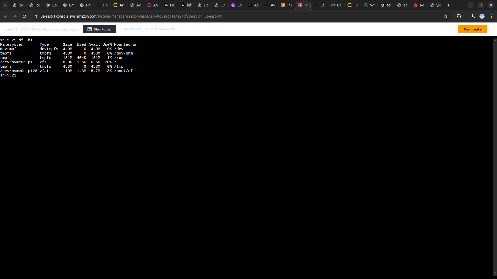

<h1 align=center> AWS Systems Manager - Conectando a uma instância EC2 via Session Manager </h1>

    

<h2> AWS Systems Manager Session Manager </h2>

O Session Manager é uma capacidade do AWS Systems Manager totalmente gerenciada. Com o Session Manager, é possível gerenciar as instâncias, os dispositivos de borda, os servidores on-premises e as máquinas virtuais (VMs) do Amazon Elastic Compute Cloud (Amazon EC2). Use um shell baseado em navegador interativo com um clique ou o AWS Command Line Interface (AWS CLI).

O Session Manager fornece gerenciamento de nós seguro e auditável sem a necessidade de abrir portas de entrada, manter bastion hosts ou gerenciar chaves SSH. O Session Manager também facilita a conformidade com políticas corporativas que exigem acesso controlado aos nós gerenciados, práticas rígidas de segurança e logs totalmente auditáveis com detalhes do acesso aos nós, sem deixar de fornecer aos usuários finais acesso em várias plataformas com um clique nos nós gerenciados.

<h2> Conteúdo do laboratório </h2>

Neste laboratório, você irá aprender a criar uma instância EC2 e uma função do IAM utilizando uma política gerenciada pela AWS para acessar a instância EC2 via Session Manager.

<h2>Tarefas a serem executadas</h2>

1. Acesse a console de gerenciamento da AWS.
2. Crie um bucket utilizando CloudFormation.
3. Verifique a criação do bucket S3.

<h2>Resultado</h2>

    

