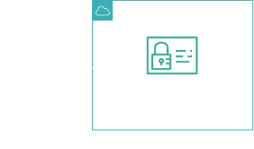
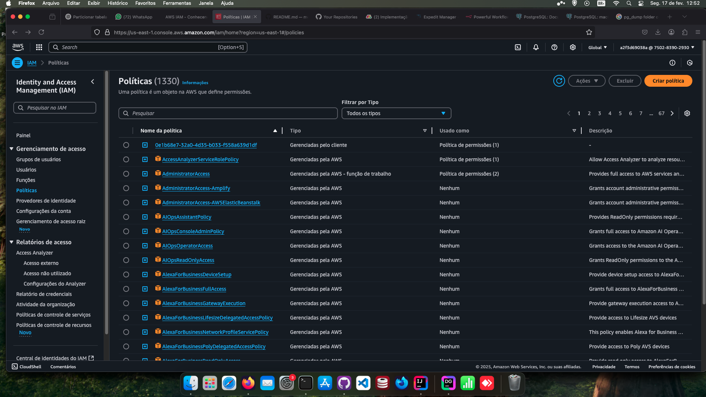

<h1 align=center> AWS IAM - Conhecendo o AWS Identity and Access Management (IAM) </h1>

<h2>Arquitetura do laboratório</h2>

    

<h2> Conteúdo do laboratório </h2>

Neste laboratório você conhecerá o serviço e o console do AWS Identity and Access Management.

<h2>Tarefas a serem executadas</h2>

1. Acesse a console de gerenciamento da AWS
2. Navegue pelo painel do IAM
3. Gerencie usuários
4. Gerencie grupos
5. Gerencie políticas
6. Use as funções (roles)

<h2>Resultado</h2>

    

