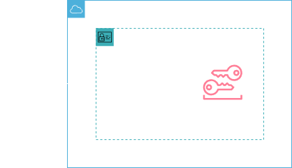
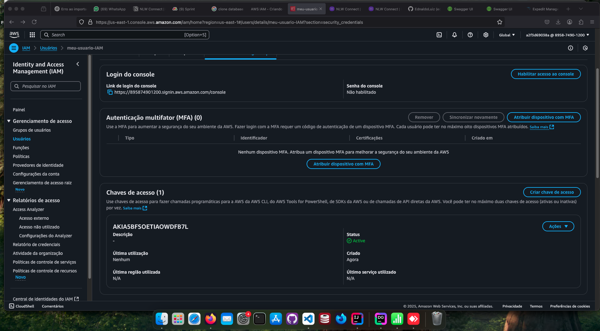

<h1 align=center> AWS IAM - Criando uma Access Key e Secret Key para um usuário no IAM  </h1>

<h2>Arquitetura do laboratório</h2>

    

<h2> Conteúdo do laboratório </h2>

Neste laboratório você aprenderá a criar um usuário do IAM e criar uma chave de acesso.

<h2>Tarefas a serem executadas</h2>

1. Acesse a console de gerenciamento da AWS.
2. Crie um usuário do IAM.
3. Crie uma Access Key.

<h2>Resultado</h2>

    

