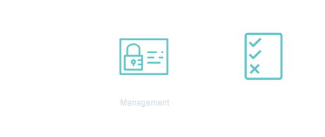
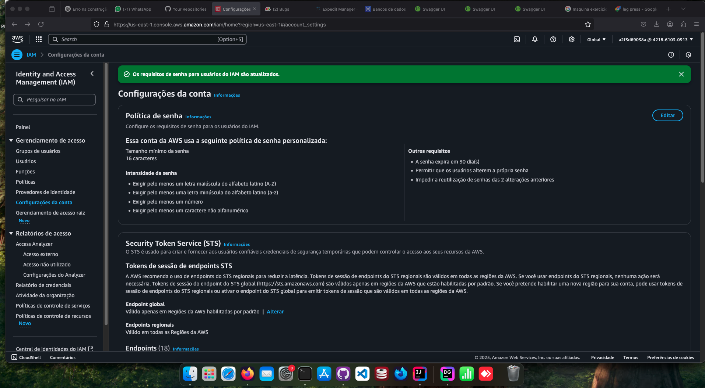

<h1 align=center> AWS IAM - Criando uma política de senha</h1>

<h2>Arquitetura do laboratório</h2>

    

<h2> Conteúdo do laboratório </h2>

Neste laboratório você aprenderá a criar uma política personalizada de senha.

<h2>Tarefas a serem executadas</h2>

1. Realizar o login na conta AWS.
2. Acessar o serviço do AWS IAM pela console.
3. Criar uma política de senha do IAM.

<h2>Resultado</h2>

    

