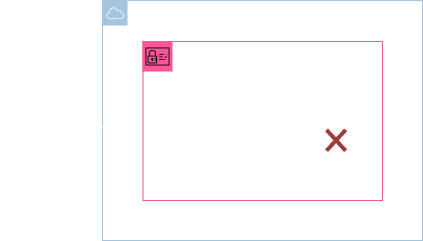

<h1 align=center> AWS IAM - Removendo acesso e desabilitando usuário </h1>

<h2>Arquitetura do laboratório</h2>

    

<h2> Conteúdo do laboratório </h2>

Neste laboratório você irá aprender a criar um usuário no IAM, liberar e remover o acesso pela console de gerenciamento da AWS.

<h2>Tarefas a serem executadas</h2>

1. Realize o login na console de gerenciamento da AWS.
2. Acesse o serviço AWS IAM.
3. Crie o seu primeiro usuário.
4. Verifique o usuário criado.
5. Acesse a conta com o seu novo usuário.
6. Remova o acesso do usuário criado.

<h2>Resultado</h2>

    

