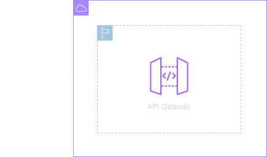
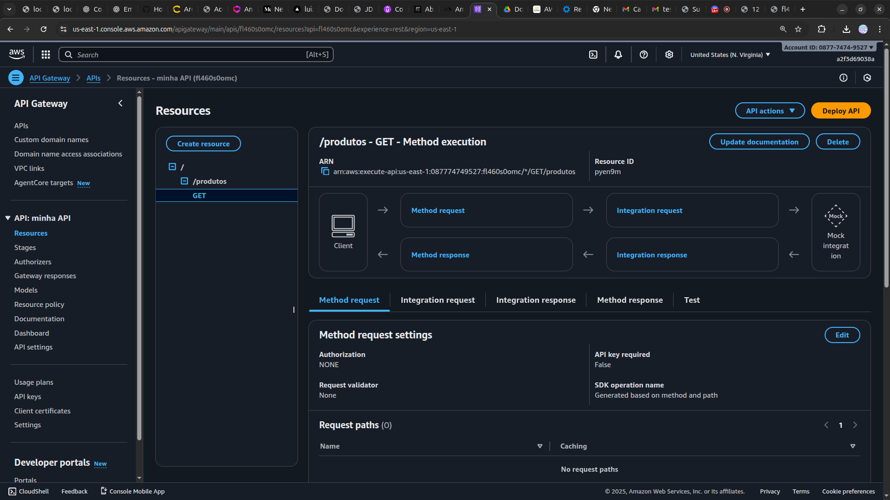

<h1 align=center>  Amazon API Gateway - Criando minha primeira API </h1>

    

<h2> Amazon API Gateway </h2>

O Amazon API Gateway, é uma ferramenta robusta e totalmente gerenciada que facilita a criação, implantação e escalabilidade de APIs de forma eficiente. Este serviço centralizado permite aos desenvolvedores criar, publicar e gerenciar APIs de maneira simplificada, proporcionando uma camada de abstração que facilita a conexão entre aplicativos, serviços e microserviços distribuídos. Com recursos avançados, como autenticação, autorização, monitoramento e controle de acesso, o API Gateway oferece uma solução completa para a exposição e proteção de APIs, contribuindo para a criação de arquiteturas flexíveis e escaláveis na nuvem.

Com apenas alguns cliques no Console de Gerenciamento da AWS, você pode criar uma API que atua como uma "porta de entrada" para que aplicativos acessem dados, lógica de negócios ou funcionalidades por meio de serviços de back-end, como aplicativos executados no Amazon Elastic Compute Cloud (Amazon EC2), no Amazon Elastic Container Service (Amazon ECS) ou no AWS Elastic Beanstalk, código executado no AWS Lambda ou qualquer aplicativo web. 

<h2> Conteúdo do laboratório </h2>

Neste laboratório, você aprenderá a criar e implantar uma API, expondo-a por meio do Amazon API Gateway.

<h2>Tarefas a serem executadas</h2>

1. Acesse a console da AWS.
2. Navegue até a API Gateway.
3. Crie uma API.
4. Faça a configuração inicial.
5. Configure os recursos e métodos.
6. Faça o deploy da API.
7. Acesse a API publicamente.

<h2>Resultado</h2>

    

    

    

