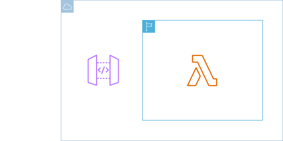
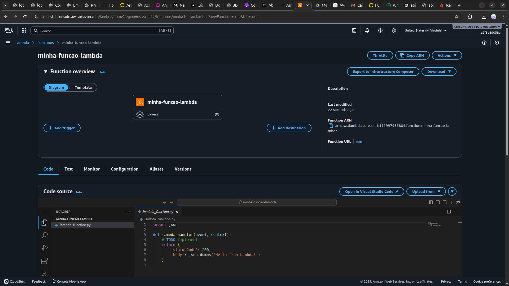
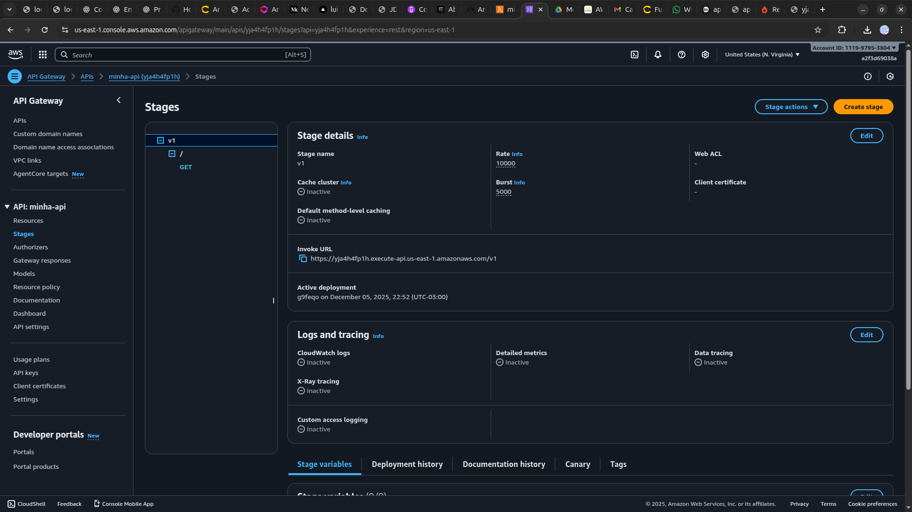
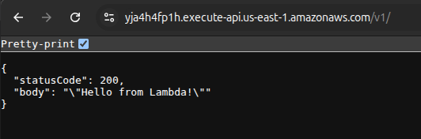

<h1 align=center>  Amazon API Gateway - Criando uma API e chamando uma função Lambda </h1>

    

<h2> Amazon API Gateway </h2>

O Amazon API Gateway é um serviço da AWS que facilita a criação, publicação, manutenção, monitoramento e proteção de APIs em escala. Ele permite que desenvolvedores exponham de forma segura as funcionalidades de seus backends para aplicativos clientes, sendo especialmente poderoso quando integrado com funções AWS Lambda.

O API Gateway atua como uma camada de gestão e roteamento de API, enquanto a Lambda processa a lógica de negócios sem a necessidade de gerenciar servidores. Essa abordagem oferece alta escalabilidade, baixo custo e uma arquitetura simplificada, ideal para diversas aplicações.

<h2> Conteúdo do laboratório </h2>

Neste laboratório você aprenderá a criar uma API no API Gateway, que invoca uma função Lambda.

<h2>Tarefas a serem executadas</h2>

1. Realize o login na console de gerenciamento da AWS.
2. Crie uma função Lambda.
3. Crie um API Gateway.
4. Crie o método.
5. Implante e utilize a API.
<h2>Resultado</h2>

    

    

    

