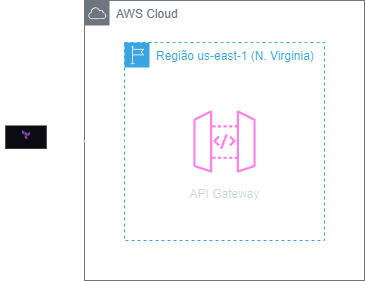
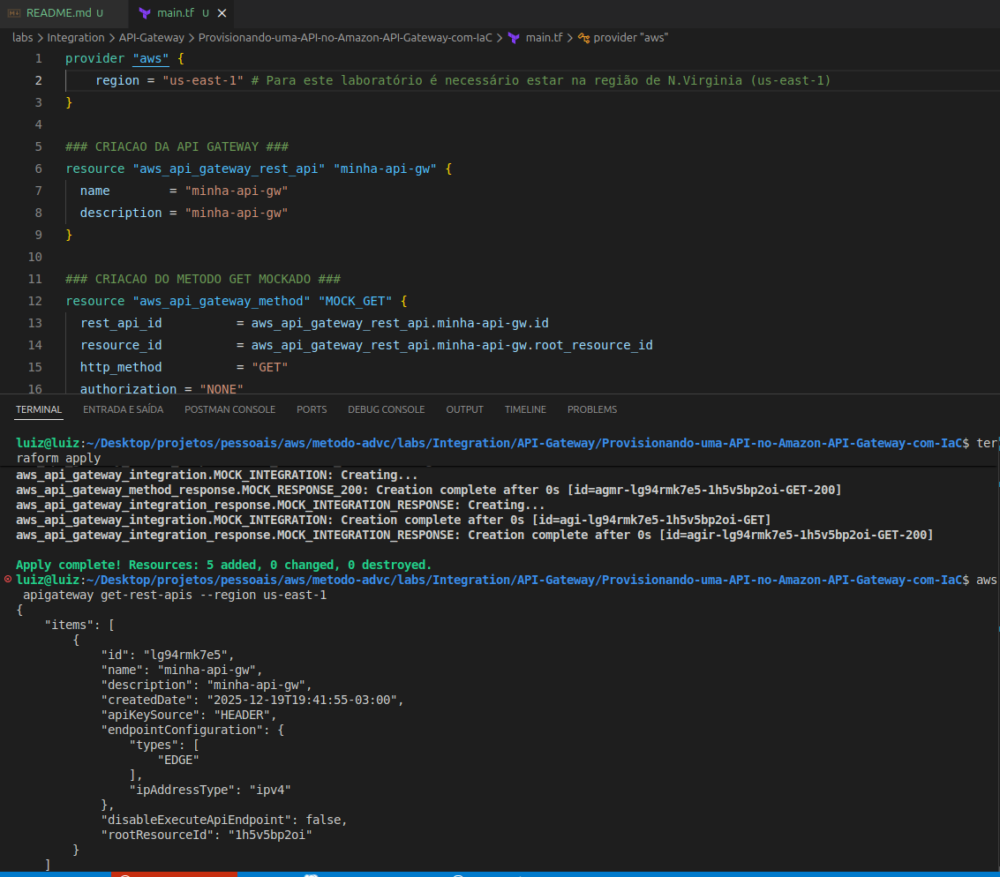

<h1 align=center> Terraform - Provisionando uma API no Amazon API Gateway com IaC </h1>

    

<h2> Terraform </h2>

O Terraform é uma ferramenta de infraestrutura como código desenvolvida pela HashiCorp, que permite aos usuários definir e provisionar data centers utilizando uma linguagem de configuração declarativa. Com o Terraform, você pode criar, gerenciar e versionar recursos de infraestrutura de maneira eficiente e automatizada. Ele suporta múltiplos provedores de serviços de nuvem, como AWS, Azure e Google Cloud, facilitando a implementação de infraestruturas híbridas e multi-cloud. A abordagem declarativa do Terraform garante consistência e previsibilidade nas implementações, enquanto seus recursos de planejamento e visualização de mudanças ajudam a evitar problemas antes da aplicação.

<h2> Amazon DynamoDB </h2>

O Amazon API Gateway é uma ferramenta robusta e totalmente gerenciada que facilita a criação, implantação e escalabilidade de APIs de forma eficiente. Este serviço centralizado permite aos desenvolvedores criar, publicar e gerenciar APIs de maneira simplificada, proporcionando uma camada de abstração que facilita a conexão entre aplicativos, serviços e micro serviços distribuídos. Com recursos avançados, como autenticação, autorização, monitoramento e controle de acesso, o API Gateway oferece uma solução completa para a exposição e proteção de APIs, contribuindo para a criação de arquiteturas flexíveis e escaláveis na nuvem.

<h2> Conteúdo do laboratório </h2>

Neste laboratório você aprenderá a provisionar uma API no Amazon API Gateway ultizando o Terraform.

<h2>Tarefas a serem executadas</h2>

1 - Configure suas credenciais do CLI
2 - Crie um arquivo de configuração Terraform (.tf)
3 - Criar uma API  com API Gateway utilizando Terraform
4 - Destruir sua API Gateway

<h2>Resultado</h2>

    

