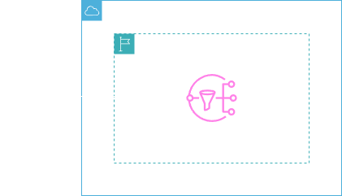
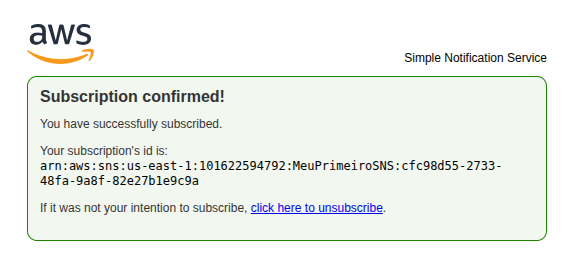

<h1 align=center> Amazon SNS - Criando um tópico de notificação por e-mail </h1>

    

<h2> Amazon Simple Notification Service (SNS) </h2>

O Amazon Simple Notification Service (Amazon SNS) envia notificações de duas maneiras: A2A e A2P. A maneira A2A fornece um sistema de mensagens com alto throughput, baseado em push para mensagens entre diversos sistemas distribuídos, microsserviços e aplicações sem servidor orientadas a eventos. Essas aplicações incluem o Amazon Simple Queue Service (SQS), o Amazon Kinesis Data Firehose, o AWS Lambda e outros endpoints HTTPS. A funcionalidade A2P, por sua vez, permite o envio de mensagens para seus clientes utilizando textos SMS, notificações por push e e-mail. 

<h2> Conteúdo do laboratório </h2>

Neste laboratório iremos aprender como criar um tópico no SNS, inscrever um e-mail no tópico e receber mensagens.

<h2>Tarefas a serem executadas</h2>

1. Acesse a console de gerenciamento da AWS.
2. Crie um tópico do SNS.
3. Crie uma assinatura.
4. Publique a mensagem no tópico.
5. Receba a mensagem enviada.

<h2>Resultado</h2>

    

