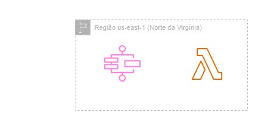
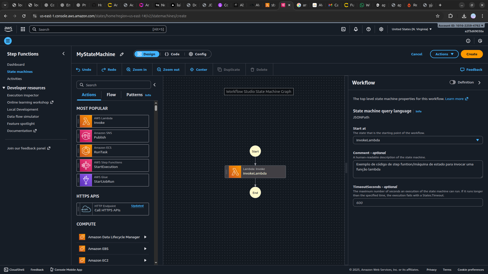
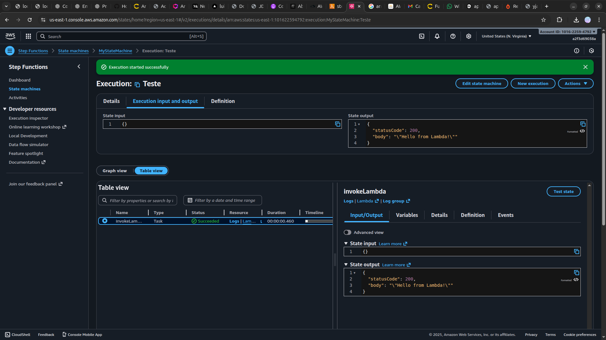

<h1 align=center>  AWS Step Functions - Criando meu primeiro workflow </h1>

    

<h2> AWS Step Functions </h2>

O AWS Step Functions é um serviço de orquestração de fluxo de trabalho na nuvem, oferecido pela Amazon Web Services (AWS). Ele permite criar e executar facilmente workflows escaláveis que coordenam a execução de diversas etapas de serviços AWS e aplicativos. Com uma interface visual intuitiva, os usuários podem projetar fluxos de trabalho baseados em estados, conectando diferentes etapas e decisões para criar automações robustas. O AWS Step Functions suporta integrações com uma ampla gama de serviços AWS, proporcionando uma abordagem eficiente para a construção de aplicações distribuídas e sistemas complexos, ao mesmo tempo em que simplifica a gestão e monitoramento desses processos. Com recursos de monitoramento, logging e controle de erros integrados, o AWS Step Functions oferece uma solução completa para gerenciar e executar fluxos de trabalho na nuvem com facilidade e eficiência.

<h2> Conteúdo do laboratório </h2>

Neste laboratório você aprenderá a criar um Lambda e executar ele com o AWS Step Functions.

<h2>Tarefas a serem executadas</h2>

1. Faça login na AWS.
2. Crie uma função Lambda.
3. Crie e teste seu Step Function.

<h2>Resultado</h2>

    

    

