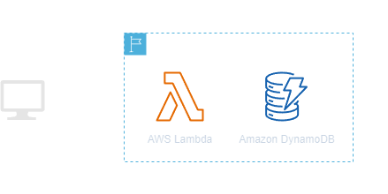
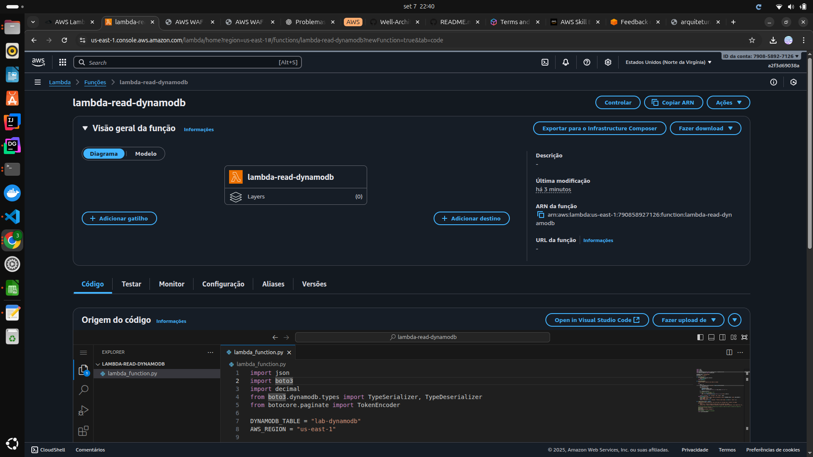
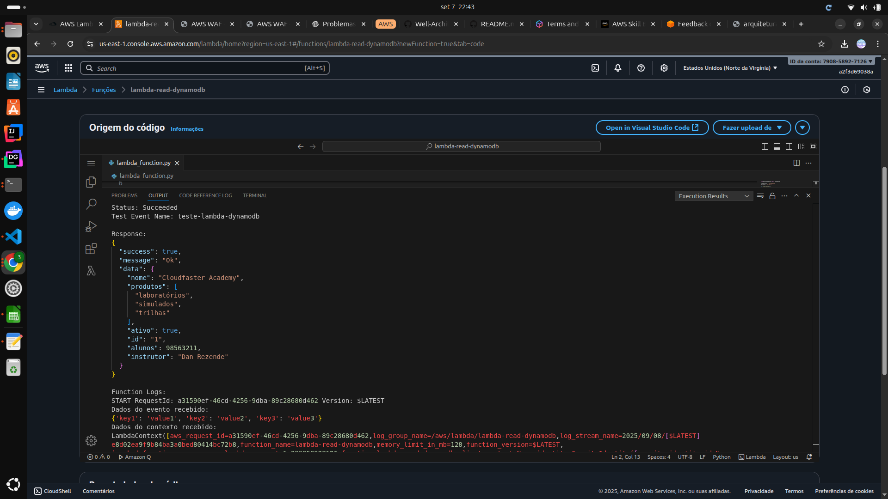

<h1 align=center> AWS Lambda - Consumindo dados de uma tabela do Amazon DynamoDB via AWS Lambda </h1>

    

<h2> Amazon DynamoDB </h2>

O Amazon DynamoDB é um serviço de banco de dados NoSQL altamente escalável, oferecido pela Amazon Web Services (AWS). Projetado para fornecer desempenho rápido e consistente, o DynamoDB é uma escolha popular para aplicativos que exigem acesso rápido e previsível aos dados, independentemente do volume. Sua estrutura sem esquema permite flexibilidade no armazenamento de dados, enquanto sua arquitetura distribuída garante a capacidade de dimensionamento horizontal conforme a demanda aumenta. Além disso, o DynamoDB oferece recursos como o provisionamento automático de capacidade e a capacidade de replicação global para garantir disponibilidade e durabilidade dos dados em escala global. Com sua facilidade de uso e integração com outros serviços da AWS, o DynamoDB destaca-se como uma solução versátil para diversas aplicações, desde pequenas à grandes escalas.

<h2> Conteúdo do laboratório </h2>

Neste laboratório iremos utilizar o AWS Lambda para acessarmos dados em uma tabela do Amazon DynamoDB.

<h2>Tarefas a serem executadas</h2>

1. Realizar o login na conta AWS.
2. Acessar o serviço do AWS IAM.
3. Criar política (policy).
4. Criar função (role).
5. Criar tabela no DynamoDB.
6. Inserir um item na tabela do DynamoDB para consulta.
7. Criar função Lambda.
8. Adicionar o código na função Lambda.
9. Testar nossa função Lambda.

<h2>Resultado</h2>

    

    

