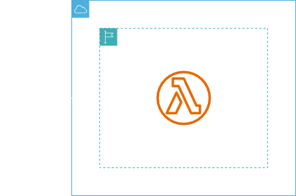

<h1 align=center>  AWS Lambda - Criando e testando sua primeira função Lambda </h1>

    

<h2> AWS Lambda </h2>

O AWS Lambda é um serviço de computação sem servidor e orientado a eventos que permite executar código para praticamente qualquer tipo de aplicação ou serviço de backend sem provisionar ou gerenciar servidores. Você pode acionar o Lambda a partir de mais de 200 serviços da AWS e aplicações de software como serviço (SaaS) e pagar apenas pelo que usar. O Lambda é amplamente utilizado para criar aplicativos e serviços em nuvem altamente eficientes, já que os desenvolvedores podem se concentrar na lógica de negócios sem se preocupar com a infraestrutura subjacente.

<h2> Conteúdo do laboratório </h2>

Neste laboratório, iremos aprender a criar e configurar um função no AWS Lambda.

<h2>Tarefas a serem executadas</h2>

1. Acesse a console de gerenciamento.
2. Crie uma função Lambda.
3. Adicione o código fonte.
4. Teste a função criada.

<h2>Resultado</h2>

    

    

