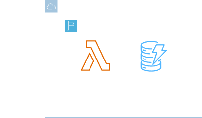
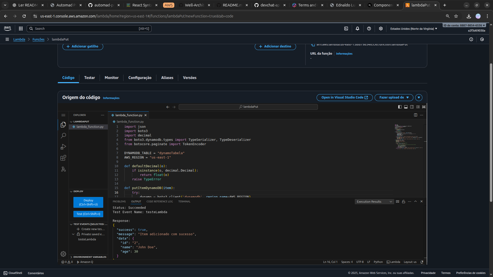
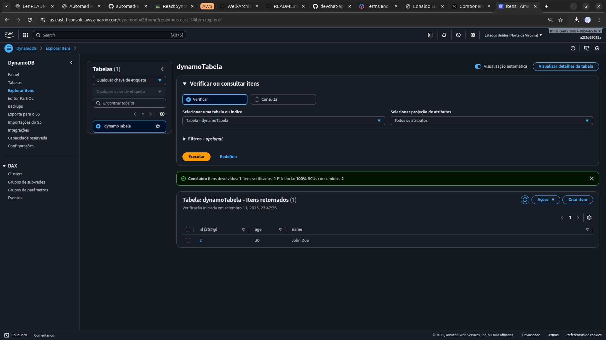

<h1 align=center> AWS Lambda - Interação do back-end com o DynamoDB </h1>

    

<h2> Amazon DynamoDB </h2>

O Amazon DynamoDB é um banco de dados NoSQL gerenciado que oferece desempenho rápido e previsível com escalabilidade automática. Ele é ideal para aplicativos que exigem alta disponibilidade, fornecendo armazenamento de dados com baixa latência e alta durabilidade.

<h2> AWS Lambda </h2>

O AWS Lambda é um serviço de computação sem servidor que executa código em resposta a eventos, gerenciando automaticamente os recursos necessários. Você paga apenas pelo tempo de execução utilizado, sem a necessidade de provisionar ou gerenciar servidores, permitindo escalabilidade automática.

<h2> Funções (Role) </h2>

As funções (roles) são permissões que atribuem permissões temporárias aos serviços e usuários. Elas permitem que instâncias do EC2, funções do Lambda, e outros serviços da AWS realizem ações seguras em seu nome, sem a necessidade de armazenar credenciais de segurança.

<h2> Conteúdo do laboratório </h2>

Neste laboratório você irá aprender a criar uma role para o Lambda e interagir com uma tabela no DynamoDB.

<h2>Tarefas a serem executadas</h2>

1. Acesse a console de gerenciamento da AWS.
2. Crie um função (role) e uma política no IAM.
3. Crie uma tabela no DynamoDB.
4. Crie um evento de teste no Lambda.

<h2>Resultado</h2>

    

    

