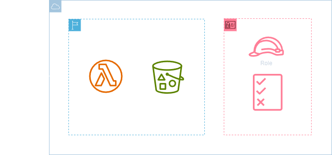

<h1 align=center> AWS Lambda - Interagindo com o Amazon S3 </h1>

    

<h2> AWS Lambda </h2>

O AWS Lambda é um serviço de computação sem servidor oferecido pela Amazon Web Services (AWS) que permite executar código de forma escalável e automatizada em resposta a eventos. Com o Lambda, você pode executar código em várias linguagens de programação, como Python, Node.js, Java, C#, entre outras, sem se preocupar com a infraestrutura subjacente.

O serviço gerencia automaticamente a capacidade necessária para executar seu código, desde pequenas tarefas até cargas de trabalho de processamento intensivo. O Lambda é altamente flexível e pode ser integrado com uma variedade de serviços da AWS, como o Amazon S3, API Gateway, Amazon DynamoDB e outros, permitindo construir arquiteturas de aplicativos modernas e orientadas a eventos de forma eficiente e econômica.

<h2> Conteúdo do laboratório </h2>

Neste laboratório você aprenderá a criar um lambda com permissão de IAM role para interagir com S3.

<h2>Tarefas a serem executadas</h2>

1. Realize o acesso a console de gerenciamento da AWS.
2. Crie um role para o Lambda.
3. Crie uma função do Lambda.

<h2>Resultado</h2>

    

