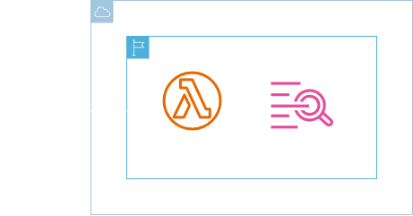
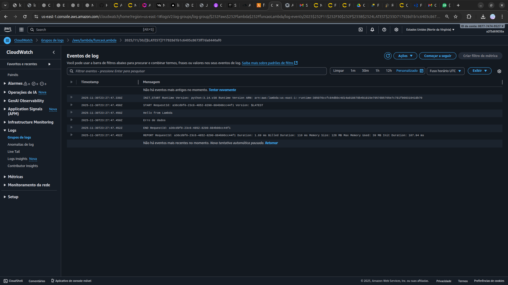

<h1 align=center> AWS Lambda - Primeiro troubleshooting em uma função com Amazon CloudWatch Logs </h1>

    

<h2> Amazon CloudWatch Logs </h2>

Você pode usar o Amazon CloudWatch Logs para monitorar, armazenar e acessar seus arquivos de log de instâncias do Amazon Elastic Compute Cloud (Amazon EC2), AWS CloudTrail, Route 53 e outras fontes. O CloudWatch Logs permite que você centralize os logs de todos os seus sistemas, aplicativos e serviços da AWS que você usa, em um único serviço altamente escalável.

Você pode então visualizá-los facilmente, pesquisá-los por códigos de erro ou padrões específicos, filtrá-los com base em campos específicos ou arquivá-los com segurança para análise futura. O CloudWatch Logs permite que você veja todos os seus logs, independentemente de sua origem, como um fluxo único e consistente de eventos ordenados por tempo.

<h2> Conteúdo do laboratório </h2>

Neste Laboratório você irá aprender a fazer seu primeiro troubleshooting em uma função Lambda com Amazon CloudWatch Logs.

<h2>Tarefas a serem executadas</h2>

1. Acesse a console de gerenciamento da AWS.
2. Crie uma função (role) do IAM.
3. Crie uma função do Lambda.
4. Verifique os log gerados com Amazon CloudWatch Logs.

<h2>Resultado</h2>

    

    

