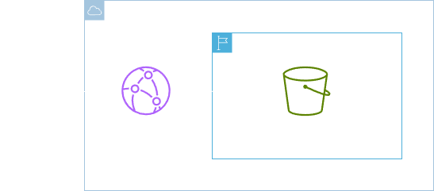
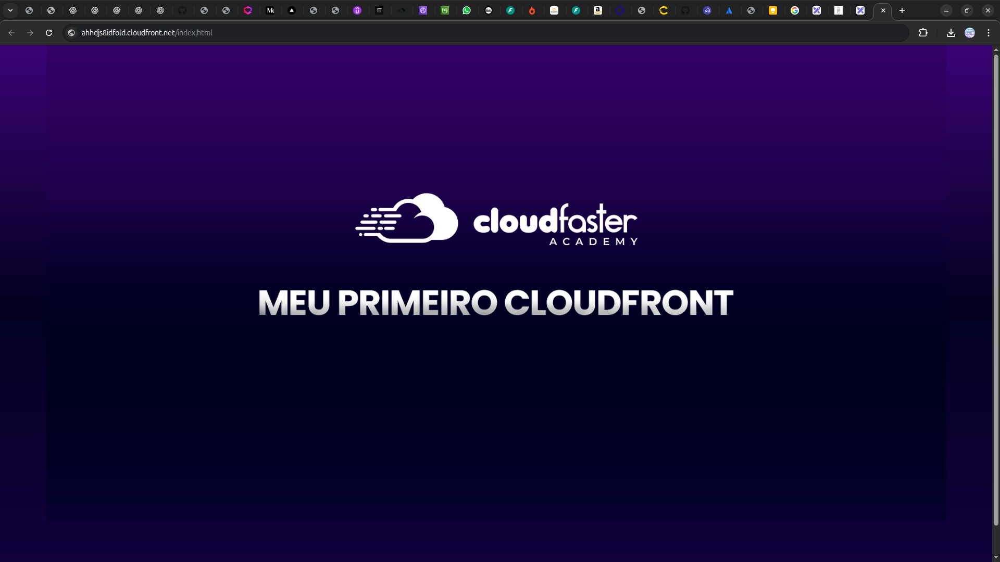
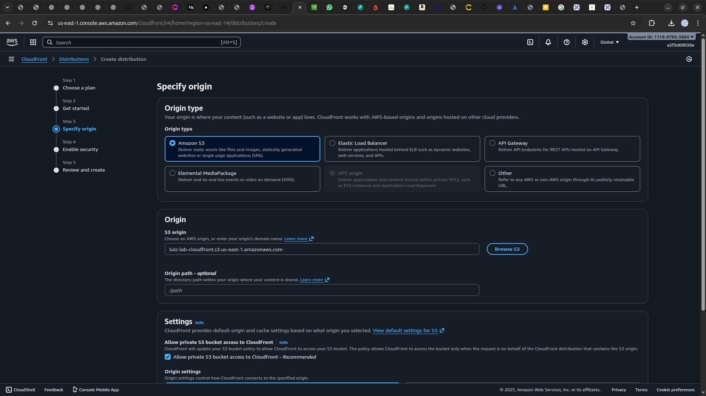

<h1 align=center> Amazon CloudFront - Criando sua primeira distribuição (CDN) </h1>

    

<h2> Amazon CloudFront </h2>

O Amazon CloudFront é um serviço de rede de entrega de conteúdo (CDN) altamente escalável e global da AWS, projetado para aprimorar o desempenho, a segurança e a confiabilidade de sites e aplicativos. Ao distribuir de forma eficiente conteúdo estático, dinâmico, de vídeo e API para usuários finais em diferentes partes do mundo, o CloudFront reduz a latência e melhora a velocidade de carregamento, proporcionando uma experiência do usuário superior. Com uma rede distribuída globalmente em mais de 600 pontos de persença, o Amazon CloudFront oferece uma solução abrangente para acelerar a entrega de conteúdo de maneira eficiente e segura em escala global.

<h2> Conteúdo do laboratório </h2>

Neste laboratório, aprenderemos a acessar a console de gerenciamento da AWS, criar um bucket no Amazon S3 e fazer o upload de um arquivo HTML. Em seguida, configuraremos uma distribuição do Amazon CloudFront e ajustaremos as permissões necessárias para acessar os conteúdos por meio do CloudFront.

<h2>Tarefas a serem executadas</h2>

1. Realize o login na console de gerenciamento da AWS.
2. Crie um Bucket no Amazon S3.
3. Faça o upload de um arquivo HTML para o Bucket S3.
4. Crie uma distribuição do Amazon CloudFront.
5. Acesse imagens por meio do CloudFront.

<h2>Resultado</h2>

    

    

