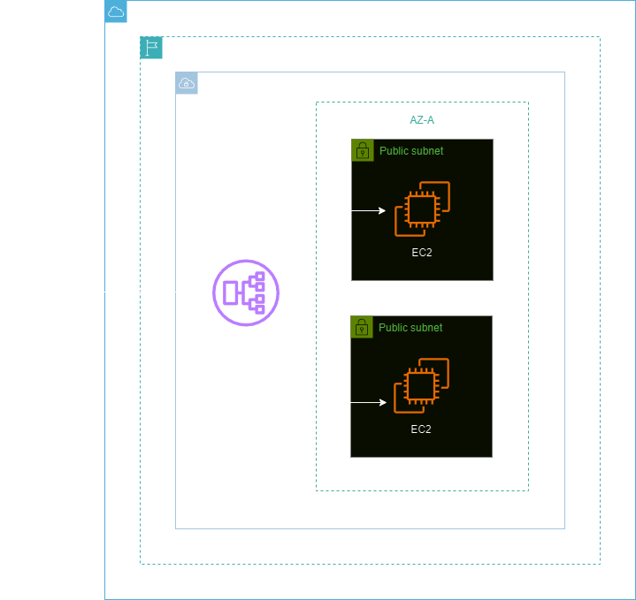

<h1 align=center> Amazon Elastic Load Balancer - Criando um ALB e associando instâncias EC2 </h1>

    

<h2> Application Load Balancer (ALB) </h2>

O ALB (Application Load Balancer) da AWS é um serviço de balanceamento de carga altamente disponível e escalável, projetado para distribuir o tráfego de aplicativos em várias instâncias EC2 ou contêineres ECS. Ele opera no nível de aplicativo (camada 7) do Modelo OSI, permitindo roteamento inteligente com base em informações do conteúdo HTTP/HTTPS.

Com o ALB, é possível criar regras sofisticadas para direcionar o tráfego para diferentes destinos com base em caminhos de URL, cabeçalhos HTTP, métodos de solicitação e até mesmo condições personalizadas. Isso o torna ideal para ambientes com várias aplicações, microserviços ou arquiteturas de contêineres.

<h2> Conteúdo do laboratório </h2>

Neste laboratório você ira aprender a criar um ALB e associá-lo a uma instâncias EC2.

<h2>Tarefas a serem executadas</h2>

1. Faça login na Console de Gerenciamento AWS.
2. Crie a Instância EC2-A.
3. Crie a Instância EC2-B.
4. Verifique as Instâncias EC2 criadas.
5. Crie um Target Group.
6. Crie um Application Load Balancer (ALB).
7. Teste seu Application Load Balancer.

<h2>Resultado</h2>

    

