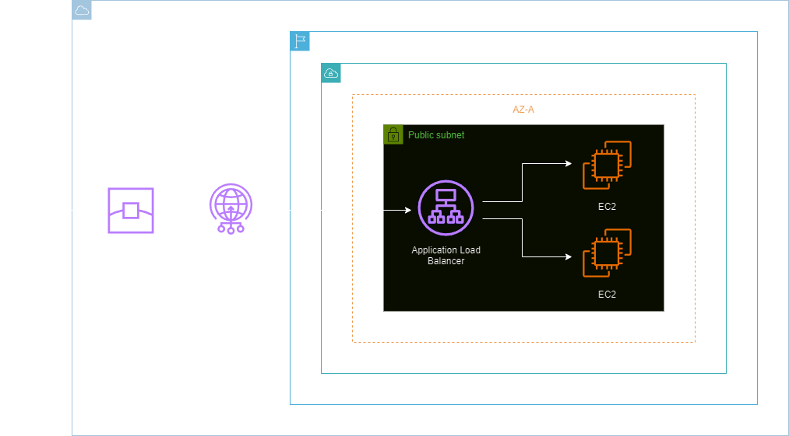
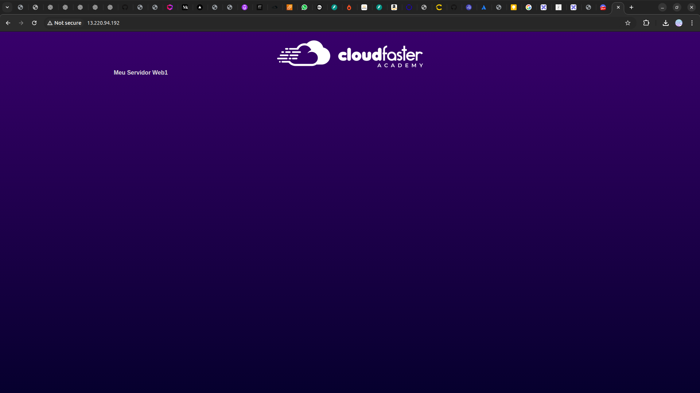
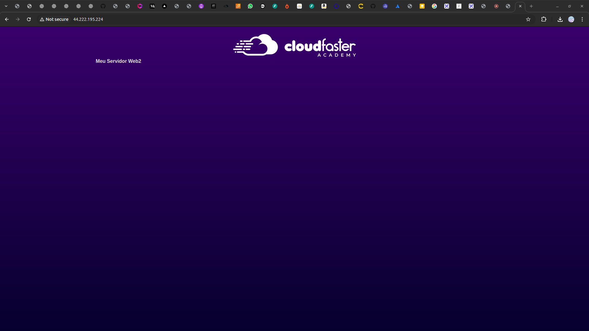

<h1 align=center> AWS Global Accelerator - Configurando o Global Accelerator em um Application Load Balancer (ALB) </h1>

    

<h2> AWS Global Accelerator </h2>

O AWS Global Accelerator é um serviço de rede que oferece disponibilidade e desempenho otimizados para aplicativos globais na nuvem AWS. Ao utilizar uma rede global da AWS, o Global Accelerator direciona automaticamente o tráfego de aplicativos para a infraestrutura mais próxima e eficiente, proporcionando uma experiência de usuário mais rápida e confiável. Com recursos avançados de roteamento e monitoramento, o Global Accelerator oferece flexibilidade e controle, garantindo uma entrega de aplicativos eficiente em uma escala global, com baixa latência e alta disponibilidade.

<h2> Conteúdo do laboratório </h2>

Neste laboratório, você fará a integração do Global Accelerator com um Application Load Balancer (ALB), aprenderá a configurar e otimizar a entrega de aplicativos, garantindo assim uma resposta eficiente e rápida em escala global,  além de aprimorar o desempenho e a disponibilidade de suas aplicações na nuvem AWS.

<h2>Tarefas a serem executadas</h2>

1. Acesse a console de gerenciamento da AWS.
2. Inicie 2 instâncias EC2 com script Bash.
3. Crie um Application Load Balancer.
4. Crie uma regra ICMP para os grupos de segurança.
5. Teste o seu AWS Global Accelerator.

<h2>Resultado</h2>

    

    

