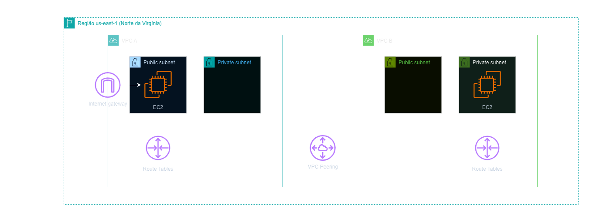
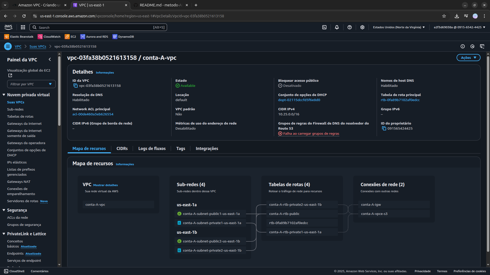
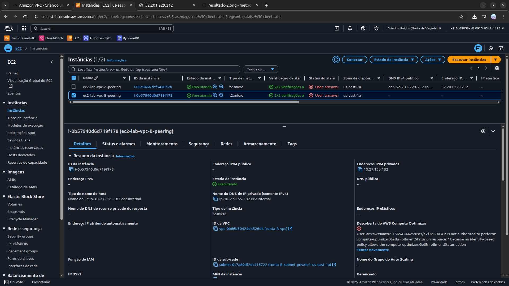
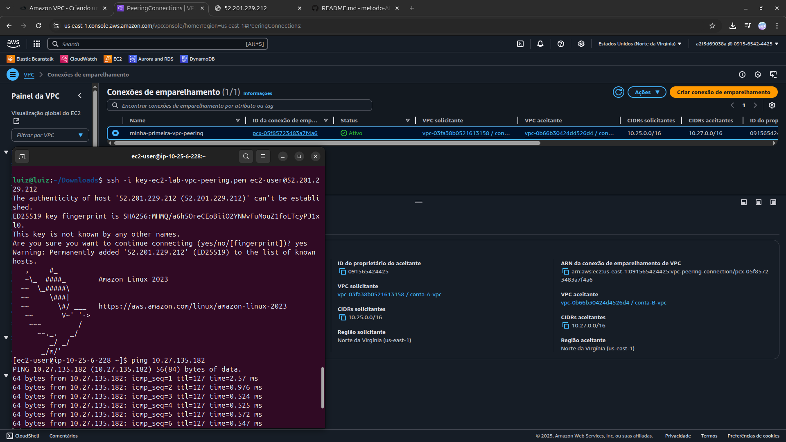

<h1 align=center> Amazon VPC - Criando um VPC Peering entre 2 VPC’s diferentes
 </h1>

<h2>Arquitetura do laboratório</h2>

    

<h2> Conteúdo do laboratório </h2>

Neste laboratório você será instruído a criar 2 VPC's e fechar um pareamento (VPC Peering) entre ambas. Esse tipo de cenário é muito comum quando é necessário conectar serviços de 2 VPC's diferentes, onde podem estar na mesma região, regiões distintas ou até mesmo em contas diferentes.

<h2>Tarefas a serem executadas</h2>

1. Acessar o Console de Gerenciamento da AWS.
2. Criar VPC's.
3. Criar Subnets.
4. Criar uma VPC Peering.
5. Editar tabelas de rotas.
6. Criar instâncias EC2 em ambas VPC's.
7. Criar uma regra para permitir ICMP na EC2 criada na VPC B.
8. Realizar acesso a sua EC2 da VPC A.
9. Acessar a Instância Via Terminal ssh no Linux e via PuTTY. 
10. Testar a comunicação entre as VPC's.

<h2>Resultado</h2>

    

    

    

    

