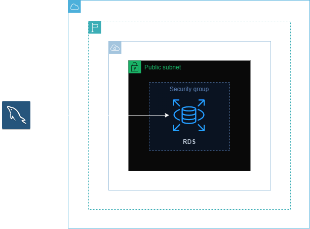
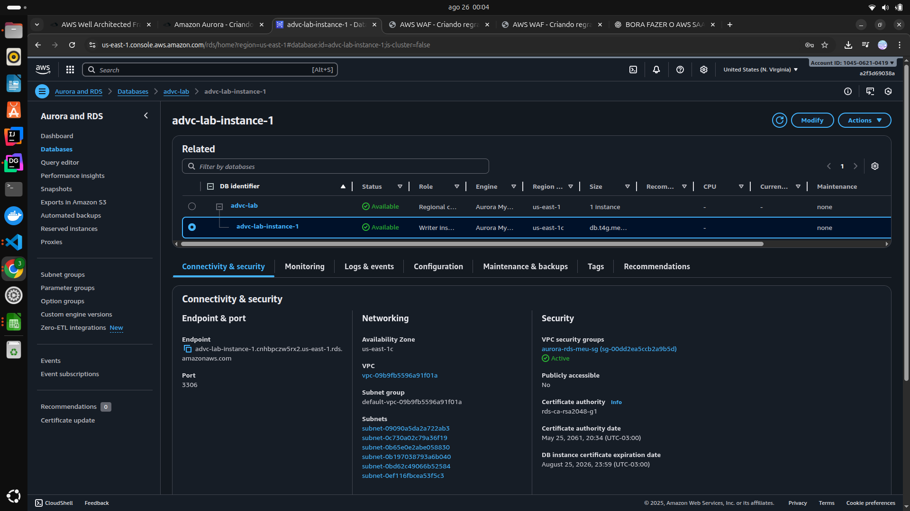

<h1 align=center> Amazon Aurora - Criando um banco MySQL </h1>

    

<h2> Amazon Aurora </h2>

O Amazon Aurora é um Sistema de Gerenciamento de Banco de Dados Relacional (RDBMS) criado para a nuvem, oferecendo total compatibilidade com MySQL e PostgreSQL. O Amazon Aurora é totalmente compatível com bancos de dados MySQL de código aberto existentes e adiciona suporte para novos lançamentos regularmente. O Aurora MySQL pode alcançar uma performance até cinco vezes maior que o MySQL, utilizando o mesmo hardware.

<h2> Conteúdo do laboratório </h2>

Neste laboratório, iremos criar um banco de dados MySQL com Aurora e acessá-lo através do Workbench. 

<h2>Tarefas a serem executadas</h2>

1. Acesse o Console de Gerenciamento da AWS.
2. Crie um Grupo de Segurança.
3. Crie uma instância de banco de dados RDS.
4. Conecte-se ao Banco de dados do RDS.

<h2>Resultado</h2>

    

