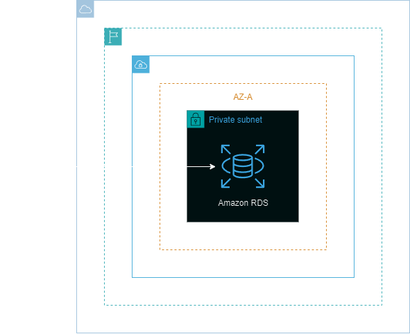
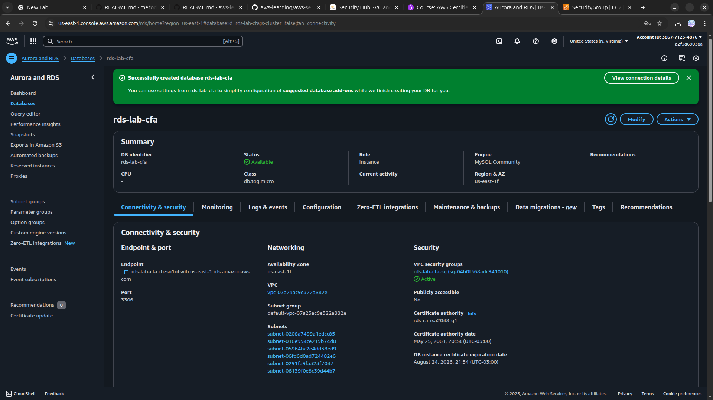

<h1 align=center> Amazon RDS - Criando um banco MySQL </h1>

    

<h2> Amazon RDS </h2>

O Amazon Relational Database Service (RDS) é um serviço de banco de dados totalmente gerenciado pela AWS que oferece escalabilidade, facilidade de configuração e manutenção, permitindo aos usuários criar, operar e escalar bancos de dados relacionais na AWS de forma eficiente. O RDS oferece suporte a diversos mecanismos de banco de dados, como MySQL, PostgreSQL, Oracle, SQL Server e outros.

Por ser totalmente gerenciado, o RDS simplifica tarefas administrativas, como backups automáticos, patches de segurança e monitoramento, possibilitando aos desenvolvedores focarem no desenvolvimento de aplicativos sem se preocupar com a infraestrutura do banco de dados.

<h2> Conteúdo do laboratório </h2>

Neste laboratório iremos aprender como criar uma instância de banco de dados do MySQL, usando o Amazon RDS.

<h2>Tarefas a serem executadas</h2>

1. Acesse a console de gerenciamento da AWS.
2. Crie um security group para a instância do RDS.
3. Crie um banco de dados MySQL.
4. Obtenha o endpoint e veja as demais informações do banco de dados.

<h2>Resultado</h2>

    

