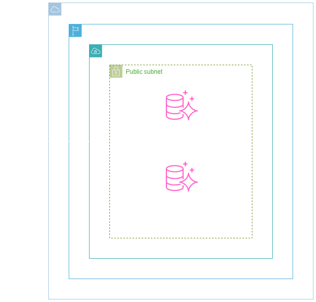
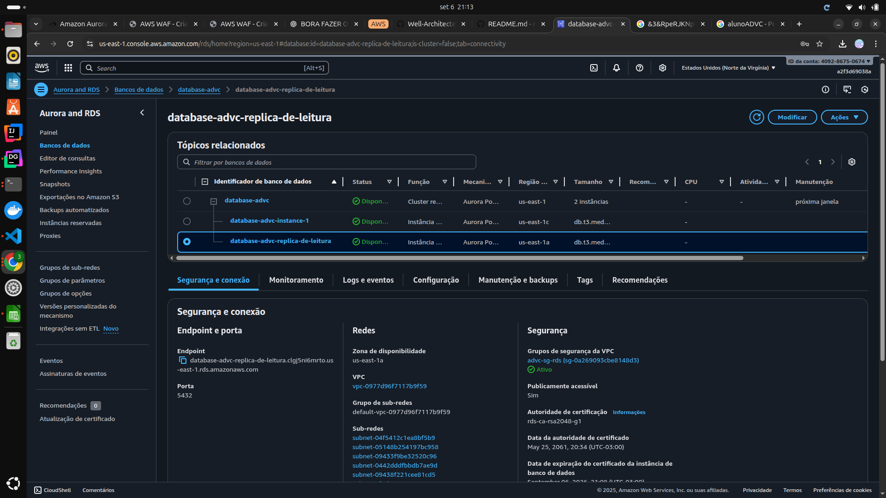
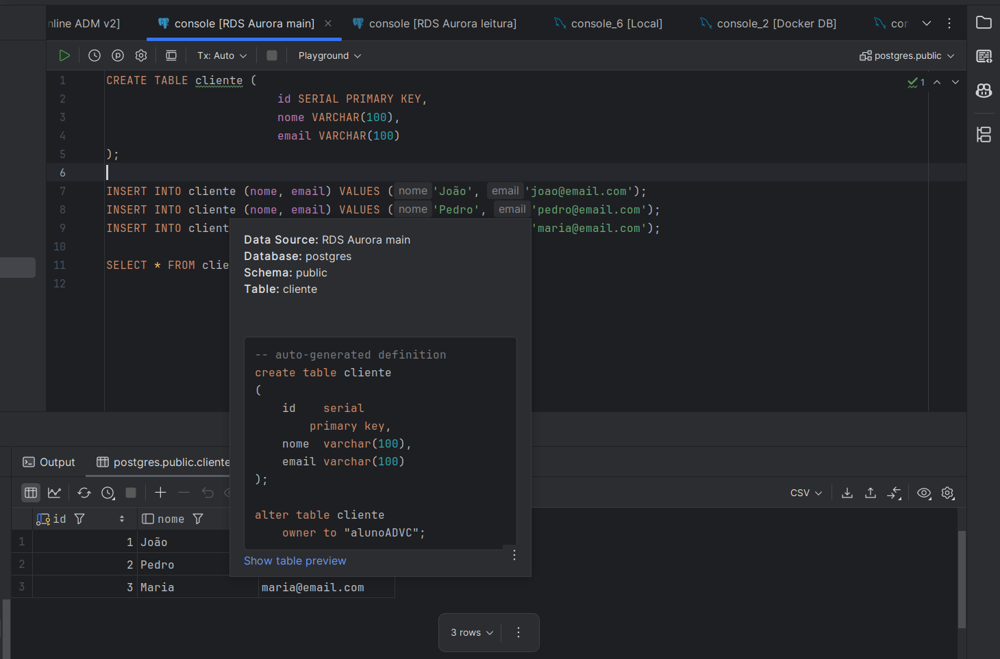

<h1 align=center> Amazon Aurora - Criando uma réplica de leitura do banco PostgreSQL </h1>

    

<h2> Amazon Aurora PostgreSQL </h2>

O Amazon Aurora é um mecanismo de banco de dados relacional gerenciado compatível com o MySQL e o PostgreSQL. O Amazon Aurora PostgreSQL é uma solução de banco de dados relacional oferecida pela AWS, conhecida por sua eficiência, escalabilidade e alta disponibilidade.

Construído sobre a base do PostgreSQL, o Aurora mantém compatibilidade total com essa plataforma de código aberto, proporcionando desempenho excepcional e uma arquitetura altamente resiliente. Com recursos como replicação automática e backups contínuos, o Amazon Aurora PostgreSQL simplifica a gestão de bancos de dados, permitindo que os usuários foquem em suas aplicações sem se preocupar com a infraestrutura subjacente.

<h2> Conteúdo do laboratório </h2>

Neste laboratório aprenderemos a criar um cluster de banco de dados do Aurora PostgreSQL, com réplica de leitura. Além de realizarmos a instalação do PSQL do PostgreSQL e estabelecermos uma conexão bem-sucedida, utilizando o cliente PSQL.

<h2>Tarefas a serem executadas</h2>

1. Acesse a console de gerenciamento da AWS.
2. Crie um cluster de banco de dados do Aurora PostgreSQL.
3. Crie uma réplica de leitura (read replica) do bancos de dados do Aurora PostgreSQL.
4. Conecte-se a um cluster de bancos de dados do Aurora PostgreSQL.
5. Teste a replicação de dados para réplica de leitura.

<h2>Resultado</h2>

    

    

