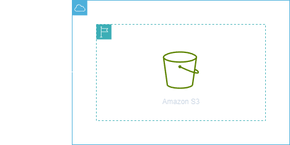

<h1 align=center> Amazon S3 - Criando seu primeiro bucket </h1>

    

<h2> Conteúdo do laboratório </h2>

Neste laboratório você aprenderá a provisionar seu primeiro bucket no Amazon S3.

<h2>Tarefas a serem executadas</h2>

1. Faça login na AWS.
2. Navegue até o Amazon S3.
3. Faça as definições de criação de um bucket S3.
4. Configure o Versionamento.
5. Revise as configurações.
6. Crie o bucket.
7. Verifique a criação do bucket.

<h2>Resultado</h2>

    

