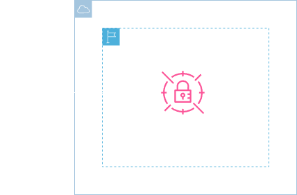
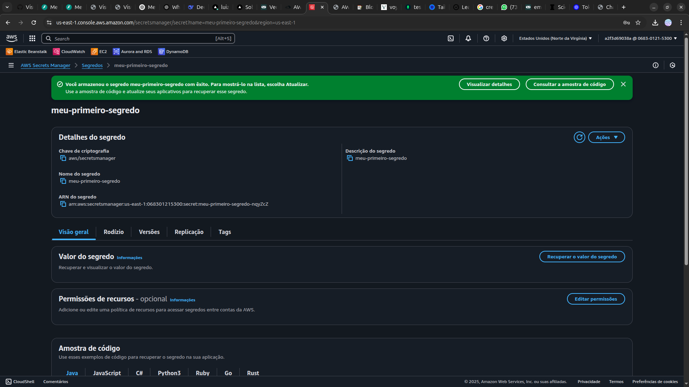

<h1 align=center> AWS Secrets Manager - Criando e acessando meu primeiro segredo na AWS</h1>

<h2>Arquitetura do laboratório</h2>

    

<h2> Conteúdo do laboratório </h2>

Neste laboratório você aprenderá a criar e a recuperar segredos armazenados no AWS Secrets Manager.

<h2>Tarefas a serem executadas</h2>

1. Acesse a console de gerenciamento da AWS.
2. Acesse o serviço AWS Secrets Manager.
3. Acesse o segredo que foi armazenado.

<h2>Resultado</h2>

    

