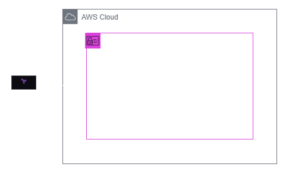
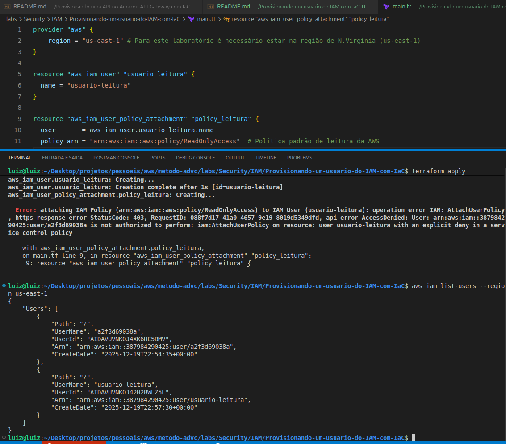

<h1 align=center> Terraform - Provisionando um usuário do IAM com IaC </h1>

    

<h2> Terraform </h2>

O Terraform é uma ferramenta de infraestrutura como código desenvolvida pela HashiCorp, que permite aos usuários definir e provisionar data centers utilizando uma linguagem de configuração declarativa. Com o Terraform, você pode criar, gerenciar e versionar recursos de infraestrutura de maneira eficiente e automatizada. Ele suporta múltiplos provedores de serviços de nuvem, como AWS, Azure e Google Cloud, facilitando a implementação de infraestruturas híbridas e multi-cloud. A abordagem declarativa do Terraform garante consistência e previsibilidade nas implementações, enquanto seus recursos de planejamento e visualização de mudanças ajudam a evitar problemas antes da aplicação.

<h2> Identity and Access Management (IAM) </h2>

O Identity and Access Management (IAM) da Amazon Web Services (AWS) é um serviço gerenciado que simplifica a administração e o controle de acesso aos seus recursos na nuvem. O IAM é como um porteiro virtual da sua conta AWS.

Usuários IAM: São entidades individuais criadas dentro da sua conta AWS. Cada usuário tem suas próprias credenciais de login (nome de usuário e senha) e pode ser atribuído a diferentes políticas de permissão.

<h2> Conteúdo do laboratório </h2>

Neste laboratório você aprenderá a provisionar um usuário do IAM ultizando o Terraform.

<h2>Tarefas a serem executadas</h2>

1 - Criar um Diretório para o Laboratório
2 - Configure suas credenciais do CLI
3- Crie um arquivo de configuração Terraform (.tf)
4 - Criar um usuário do IAM utilizando Terraform
5 - Destruir o usuário do IAM criado

<h2>Resultado</h2>

    

