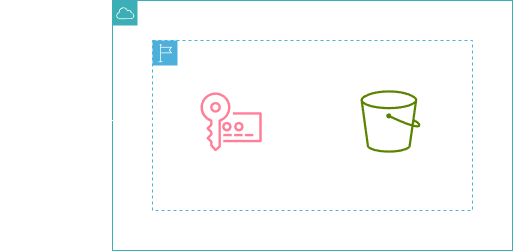
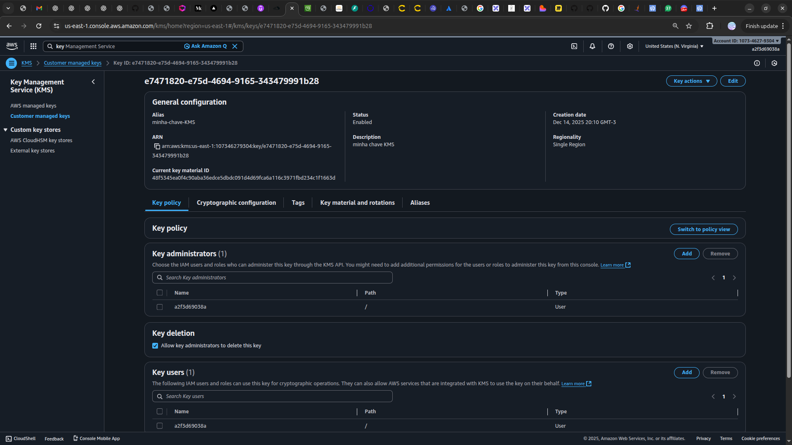
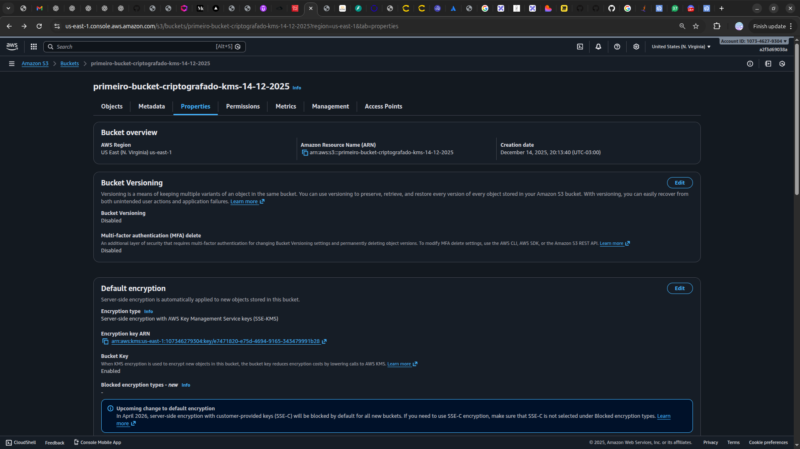

<h1 align=center> AWS KMS - Primeiros passos com o AWS KMS </h1>

    

<h2> AWS Key Management Service (KMS) </h2>

O AWS Key Management Service (KMS) é um serviço gerenciado que facilita a criação e o controle de chaves de criptografia utilizadas para proteger seus dados. Integrado com outros serviços da AWS, o KMS permite gerenciar chaves de maneira centralizada e segura, oferecendo uma interface simples para a criação, rotação e controle de acesso a essas chaves. Com ele, você pode criptografar dados em repouso e em trânsito, garantindo a conformidade com as regulamentações de segurança. 

<h2> Conteúdo do laboratório </h2>

Neste laboratório, você irá aprender a gerar uma chave no AWS KMS para criptografar seus arquivos no S3

<h2>Tarefas a serem executadas</h2>

1. Acesse a console de gerenciamento da AWS.
2. Crie uma chave do KMS.
3. Crie um bucket usando a chave criada.

<h2>Resultado</h2>

    

    

