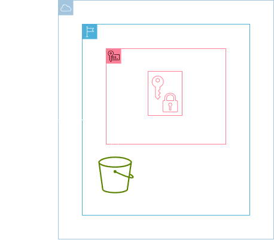
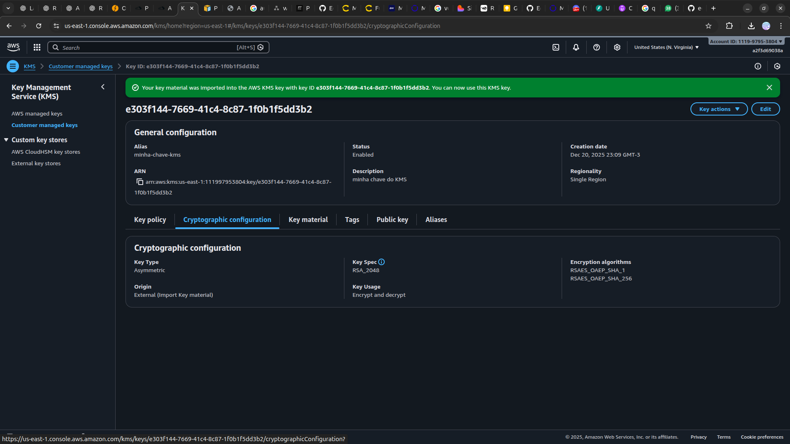
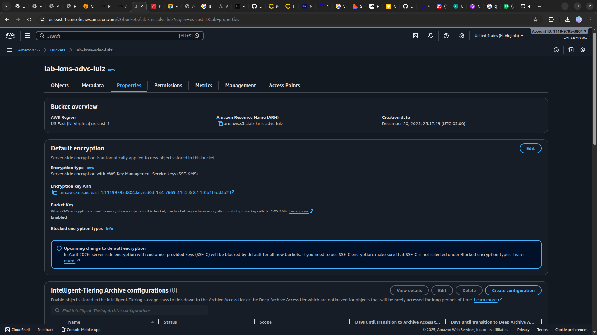

<h1 align=center> AWS KMS - Simulando a criação e importação de uma chave externa de criptografia </h1>

    

<h2> AWS Key Management Service (AWS KMS) </h2>

O AWS Key Management Service (AWS KMS) é um serviço de gerenciamento de chaves totalmente gerenciado que facilita a criação e controle centralizado de chaves de criptografia. Com o KMS, os usuários podem criar e gerenciar chaves mestras de criptografia, que são essenciais para proteger dados sensíveis armazenados em serviços da AWS e em aplicativos personalizados. O KMS oferece recursos como rotação automática de chaves, auditoria de acesso às chaves e integração com o AWS CloudTrail para rastrear eventos relacionados à segurança. Ele desempenha um papel fundamental na implementação de práticas seguras de criptografia e na conformidade com requisitos de segurança.

<h2> Conteúdo do laboratório </h2>

Neste laboratório, você aprenderá a importar o material da chave para o AWS KMS. Você aprenderá a criar uma chave KMS sem material de chave, com a origem definida como EXTERNAL. Além disso, você aprenderá a baixar uma chave pública de empacotamento e um token de importação para proteger a importação do material da chave. Adicionalmente, você aprenderá a criptografar o material da chave usando a chave pública de empacotamento e a importar o material da chave criptografado para o AWS KMS.

<h2>Tarefas a serem executadas</h2>

1. Faça login na console de gerenciamento da AWS.
2. Importe uma chave para o KMS.
3. Crie, criptografe e faça o upload do material de chave.
4. Crie um bucket no S3 utilizando a chave armazenada no KMS.

<h2>Resultado</h2>

    

    

