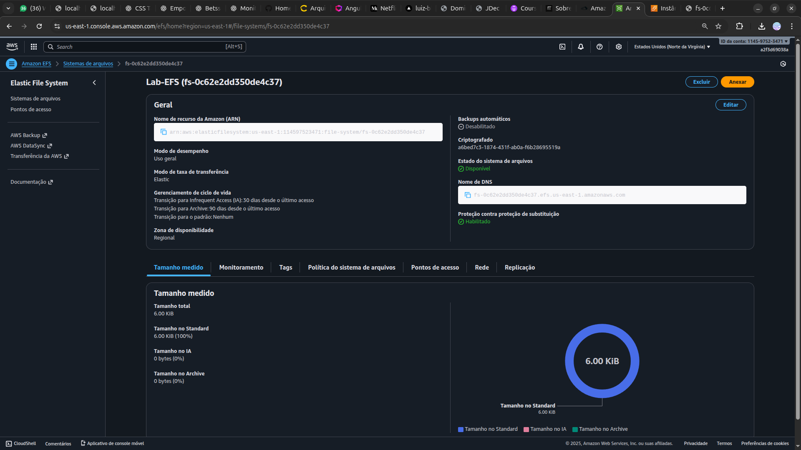

<h1 align=center>  Amazon EFS - Configurando um volume entre duas EC2 Linux </h1>

    

<h2> Amazon Elastic File System (Amazon EFS) </h2>

Amazon EFS é um serviço de armazenamento em nuvem da AWS que oferece armazenamento de arquivos compartilhado e escalável para instâncias de computação na nuvem. Permite acesso simultâneo a um sistema de arquivos por várias instâncias, é altamente disponível e durável, e ajusta automaticamente sua escala de armazenamento conforme necessário. É ideal para uma variedade de cargas de trabalho na nuvem.

<h2> Conteúdo do laboratório </h2>

Neste laboratório iremos aprender a implementar na prática um Elastic File System (EFS) na AWS. O processo abrange a criação do EFS, a configuração dos grupos de segurança das instâncias EC2 e do EFS para permitir uma comunicação segura entre eles, além da realização do procedimento de montagem do sistema de arquivos nas instâncias EC2. Essas competências são essenciais para estabelecer uma infraestrutura de armazenamento flexível e escalável na nuvem AWS.

<h2>Tarefas a serem executadas</h2>

1. Acesse o Console de Gerenciamento da AWS.
2. Crie o Grupos de Segurança (Security Group) das EC2.
3. Crie o Grupo de Segurança para o EFS.
4. Crie duas instâncias EC2.
5. Crie um Amazon Elastic File System (EFS).
6. Monte o Sistema de Arquivos em sua Instância do EC2-A e teste o Sistema de Arquivos do EFS.

<h2>Resultado</h2>

    

    

    

