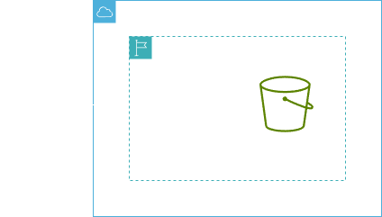
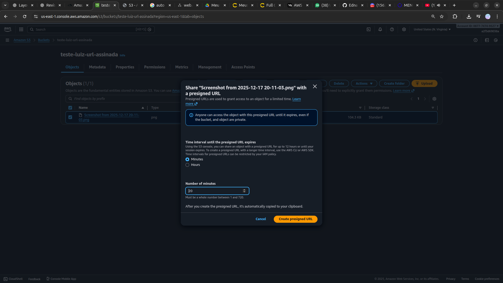

<h1 align=center>  Amazon S3 - Armazenando e acessando uma imagem com URL assinada no S3 </h1>

    

<h2> Amazon S3 URLs pré-assinadas </h2>

Por padrão, todos os objetos do Amazon S3 são privados, somente o proprietário dos objetos tem permissão para acessá-los. No entanto, o proprietário dos objetos pode compartilhá-los com outras pessoas criando um URL pré-assinado. Uma URL pré-assinada usa credenciais de segurança para conceder permissão por tempo limitado para baixar objetos. 

URLs assinadas são úteis para fornecer acesso seguro e controlado a arquivos privados, como downloads de documentos, imagens ou vídeos, garantindo que apenas usuários autorizados possam acessar os dados por um período de tempo limitado.

<h2> Conteúdo do laboratório </h2>

O objetivo deste laboratório é criar um bucket no S3 e armazenar de forma privada, uma imagem. Em seguida, disponibilizar de forma segura e momentânea através de uma URL pré-assinada, o arquivo.

<h2>Tarefas a serem executadas</h2>

1. Acesse a console de gerenciamento da AWS.
2. Crie um bucket S3.
3. Acesse uma imagem utilizando uma URL pré-assinada.

<h2>Resultado</h2>

    

