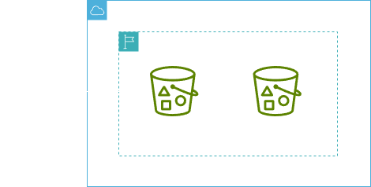

<h1 align=center> Amazon S3 - Implementando uma política de bucket no S3 </h1>

    

<h2> Amazon S3 </h2>

O Amazon S3 (Amazon Simple Storage Service) é um serviço de armazenamento em nuvem oferecido pela Amazon Web Services (AWS). Ele permite armazenar e recuperar quantidades massivas de dados de forma segura e escalável. Os dados são armazenados em objetos, que podem variar de alguns bytes a até 5 terabytes de tamanho.

<h2> Replicação de Bucket </h2>

É uma funcionalidade que permite criar cópias dos dados de um bucket, o que pode ser útil para garantir a disponibilidade dos dados em caso de falha em uma região específica ou para cumprir requisitos de conformidade que exijam a redundância dos dados.

<h2> Conteúdo do laboratório </h2>

Neste laboratório você verá como acessar o Amazon S3, criar buckets de origem e destino, além de ativar a replicação entre os mesmos.

<h2>Tarefas a serem executadas</h2>

1. Acessar a console de gerenciamento AWS.
2. Criar buckets e defini-los como de origem e destino.
3. Realizar a ativação de replicação.

<h2>Resultado</h2>

    

    

    

    

