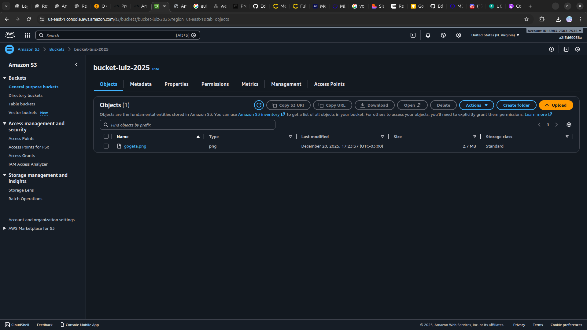

<h1 align=center> Amazon S3 - Configuração Avançada de Políticas do Amazon S3 </h1>

<h2> Amazon S3 </h2>

O Amazon S3 (Simple Storage Service) é um serviço de armazenamento de objetos altamente escalável, durável e seguro oferecido pela Amazon Web Services (AWS).

Projetado para dados em escala, virtualmente ilimitado, adequado para uma variedade de casos de uso, incluindo backup, arquivamento, distribuição de conteúdo e hospedagem de sites.

Além da escalabilidade e durabilidade, o S3 oferece recursos avançados, como controle de acesso granular, versões de objetos, transferência de dados criptografada e integração fácil com outros serviços da AWS, tornando-o uma escolha fundamental para o armazenamento e gerenciamento eficiente de dados na nuvem.

<h2> Conteúdo do laboratório </h2>

Neste laboratório, você aprenderá a provisionar um bucket do Amazon S3, configurar uma política de bucket que permite apenas conexões HTTPS e aplicar uma política de uso de chave do KMS para aceitar exclusivamente objetos criptografados com uma chave específica. É um tipo de uso bem específico, não é para uso comum, e às vezes utilizado por empresas que têm requisitos bem específicos de segurança e criptografia.

<h2>Tarefas a serem executadas</h2>

1. Configuração Inicial do AWS CLI
2. Criando um Bucket no Amazon S3
3. Habilitando o Uso Exclusivo de Conexões Seguras (HTTPS) no Bucket
4. Validando a Política de Segurança HTTPS no Amazon S3
5. Gerando uma Chave de Criptografia KMS no AWS
6. Aplicando uma Política para Exigir Criptografia KMS nos Uploads
7. Testando a Política KMS no Postman

<h2>Resultado</h2>

    

