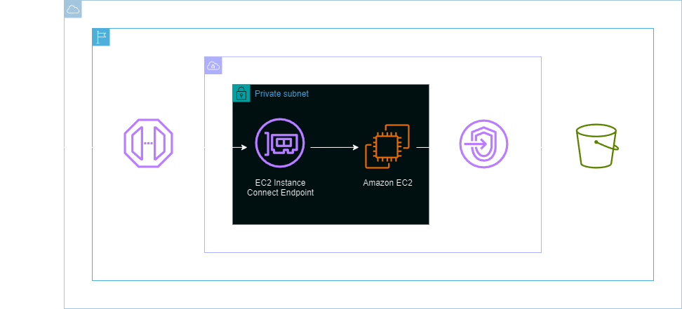
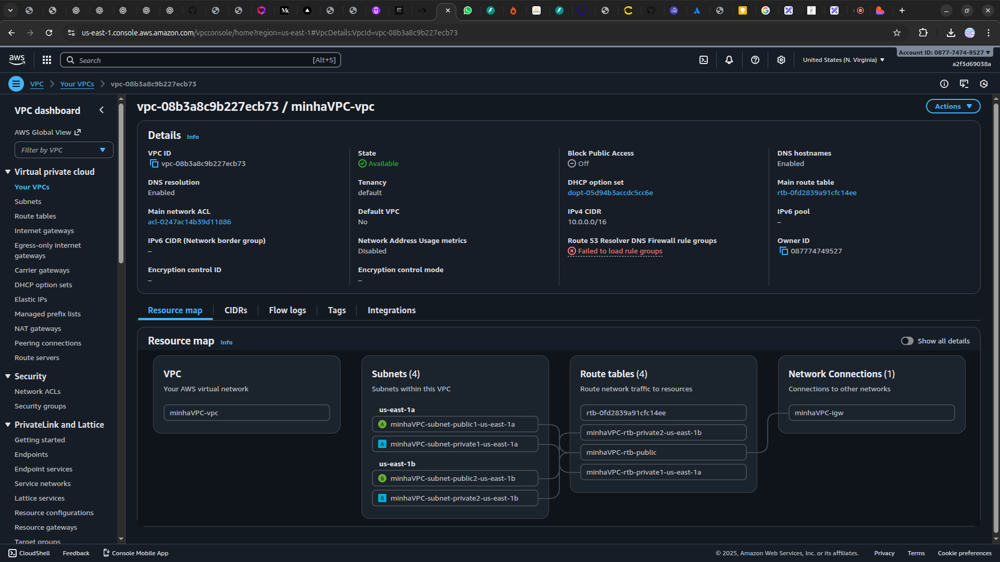

<h1 align=center> Amazon S3 - Criando um VPC endpoint para acessar um bucket </h1>

    

<h2> Endpoints de Gateway para o Amazon S3 </h2>

Os endpoints de gateway para o Amazon S3 permitem que você acesse o serviço de armazenamento em nuvem diretamente de sua Amazon Virtual Private Cloud (VPC), sem passar pela Internet pública. Esses endpoints garantem comunicação privada e segura, roteando o tráfego da VPC diretamente para o Amazon S3.Isso resulta em uma transferência de dados mais eficiente e segura, uma vez que o tráfego ocorre internamente na rede da AWS.

<h2> Conteúdo do laboratório </h2>

Neste laboratório você ira aprender a criar uma Virtual Private Cloud (VPC), implantar uma instância EC2 em uma subnet privada, endpoint de gateway para o Amazon S3 e endpoint EC2 Instance Connect.

<h2>Tarefas a serem executadas</h2>

1. Faça login na console de gerenciamento AWS.
2. Crie uma VPC e subnets.
3. Crie um endpoint do S3.
4. Crie uma política.
5. Crie uma função.
6. Crie uma instância EC2.
7. Crie um endpoint de EC2 Instance Connect.
8. Crie um bucket no Amazon S3.
9. Adicione a função na Instância EC2.
10. Realize o acesso a instância via Instance Connect.
11. Teste o endpoint do Amazon S3 utilizando o AWS CLI.

<h2>Resultado</h2>

    

