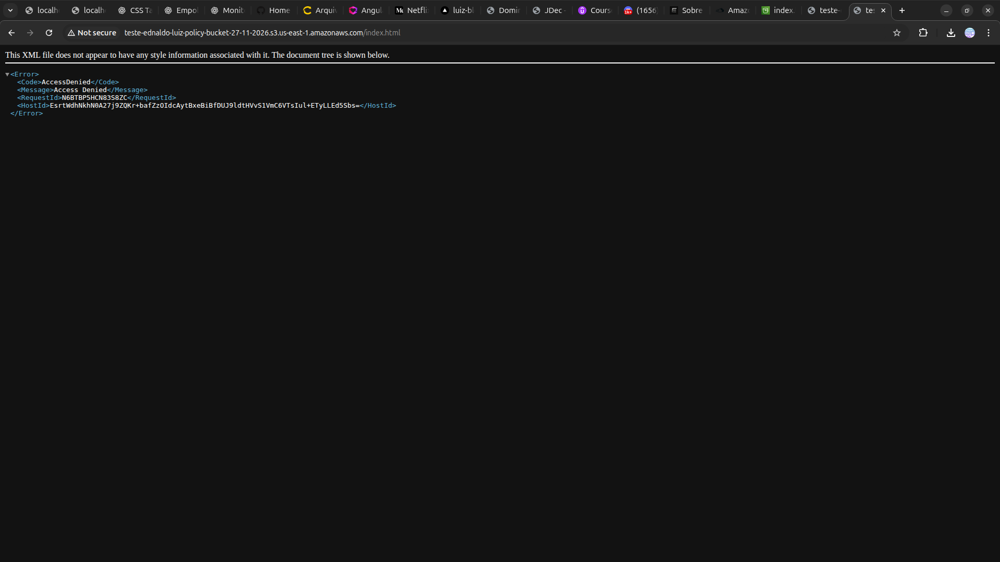

<h1 align=center> Amazon S3 - Implementando uma política de bucket no S3 </h1>

    

<h2> Políticas de Bucket </h2>

Com as políticas de bucket do Amazon S3, você pode forçar o uso de criptografia nas chamadas de API que consomem os objetos no S3, aumentando a postura de segurança do seu ambiente. Neste exemplo, iremos criar uma política para reforçar a segurança ao restringir o acesso ao bucket S3 apenas a solicitações feitas por meio de conexões seguras, usando TLS (HTTPS).

<h2> Conteúdo do laboratório </h2>

O Objetivo deste laboratório é criar um bucket S3, atribuir uma política personalizada para limitar acessos forçando uso de SSL, armazenar um objeto no bucket, validar o acesso ao objeto com uma chamada criptografada usando HTTPS e validar o bloqueio no acesso na chamada sem criptografia HTTP.

<h2>Tarefas a serem executadas</h2>

1. Realizar o login na conta AWS.
2. Acessar o serviço do Amazon S3.
3. Criar e acessar um bucket no serviço S3.
4. Anexar uma política ao bucket S3.
5. Adicionar uma arquivo ao bucket.
7. Testar a política implantada.

<h2>Resultado</h2>

    

    

