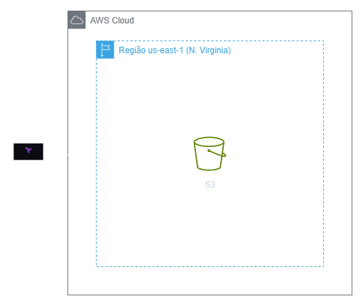
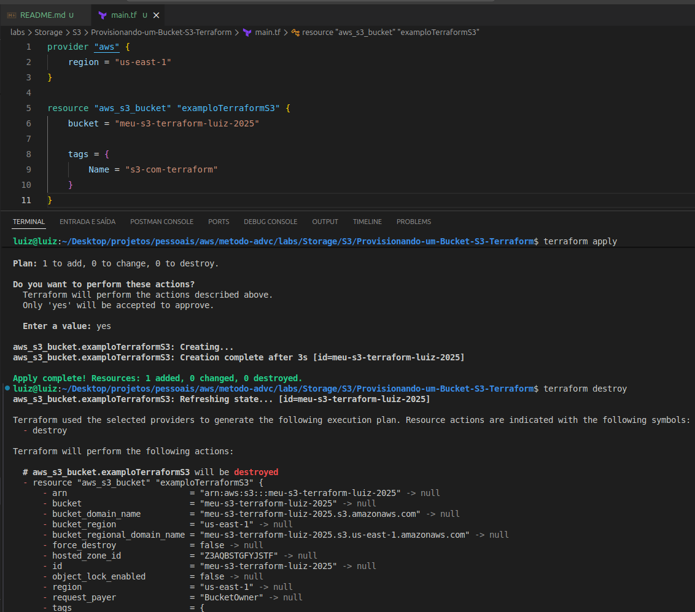

<h1 align=center> Terraform - Provisionando um Bucket S3 </h1>

    

<h2> Terraform </h2>

O Terraform é uma ferramenta de infraestrutura como código desenvolvida pela HashiCorp, que permite aos usuários definir e provisionar data centers utilizando uma linguagem de configuração declarativa. Com o Terraform, você pode criar, gerenciar e versionar recursos de infraestrutura de maneira eficiente e automatizada. Ele suporta múltiplos provedores de serviços de nuvem, como AWS, Azure e Google Cloud, facilitando a implementação de infraestruturas híbridas e multi-cloud. A abordagem declarativa do Terraform garante consistência e previsibilidade nas implementações, enquanto seus recursos de planejamento e visualização de mudanças ajudam a evitar problemas antes da aplicação.

<h2> Amazon Simple Storage Service (S3) </h2>

O Amazon S3 é uma solução de armazenamento escalável, segura e altamente disponível oferecida pela AWS. Ele permite armazenar e recuperar grandes volumes de dados, estruturados ou não, com facilidade, acessíveis pela web através de interfaces simples. Com recursos como versionamento, criptografia e políticas de controle de acesso, o S3 é ideal para backup, arquivamento, hospedagem de sites estáticos e suporte a big data e machine learning.

<h2> Conteúdo do laboratório </h2>

Neste laboratório, você aprenderá a realizar o provisionamento de instâncias EC2 na Amazon Web Services (AWS) e a instalar o Docker automaticamente por meio de um script de inicialização.

<h2>Tarefas a serem executadas</h2>

1 - Configure suas credenciais do CLI
2 - Crie um arquivo de configuração Terraform (.tf)
3 - Criar um S3 utilizando Terraform
4 - Destruir seu S3

<h2>Resultado</h2>

    

