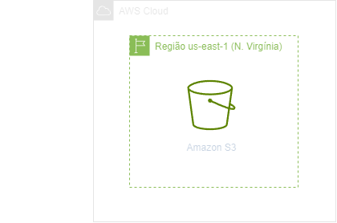
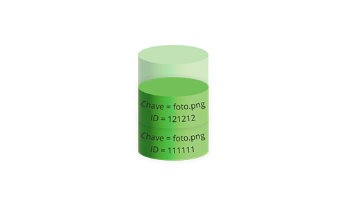
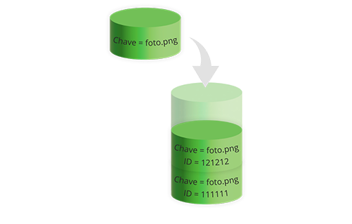
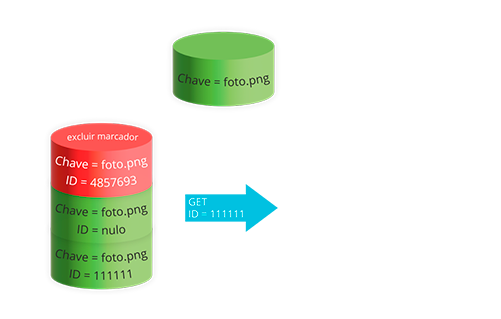
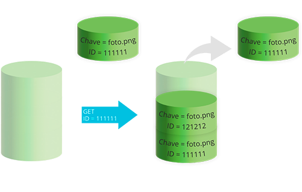
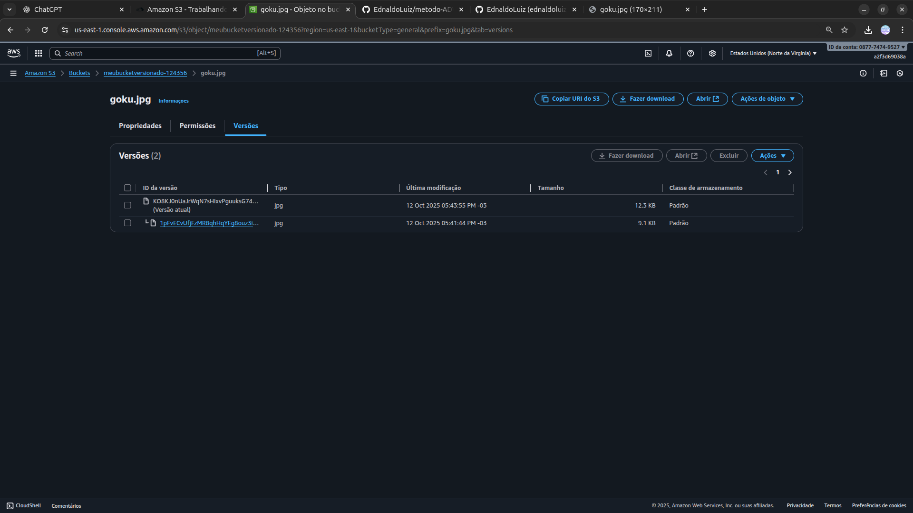

<h1 align=center> Amazon S3 - Trabalhando com versionamento no S3
Dificuldade: Iniciante </h1>

    

<h2> Amazon S3 (Simple Storage Service) </h2>

O Amazon S3 (Simple Storage Service) é um serviço de armazenamento na nuvem altamente escalável e durável oferecido pela Amazon Web Services (AWS). Projetado para armazenar e recuperar qualquer quantidade de dados a qualquer momento, o S3 proporciona confiabilidade, segurança e desempenho excepcionais. O S3 é amplamente utilizado para backup, hospedagem de conteúdo, distribuição de arquivos e como repositório central para dados de aplicativos, proporcionando uma solução versátil para diversas necessidades de armazenamento na nuvem.

O Amazon S3 oferece funcionalidade de versionamento, permitindo que os usuários controlem e gerenciem diferentes versões de objetos armazenados no serviço. Com o versionamento ativado em um bucket do S3, cada modificação em um objeto resulta em uma nova versão, mantendo um histórico completo das alterações ao longo do tempo. Isso proporciona uma camada adicional de segurança e recuperação, pois mesmo se um objeto for excluído acidentalmente, as versões anteriores ainda estarão disponíveis. O versionamento no S3 é uma ferramenta valiosa para rastrear e gerenciar alterações em arquivos, garantindo a integridade e a disponibilidade dos dados armazenados na nuvem da AWS. 

<h2> Como funciona o versionamento no S3 </h2>

Utilizando o versionamento no Amazon S3, é possível manter várias versões de um objeto em um bucket, permitindo assim a recuperação de objetos que foram excluídos ou substituídos acidentalmente.

<h3> IDs de versão </h3>

Utilizando o versionamento no Amazon S3, é possível manter várias versões de um objeto em um bucket, permitindo assim a recuperação de objetos que foram excluídos ou substituídos acidentalmente.

    

<h3> Fluxos de trabalho de versionamento </h3>

Ao recuperar um objeto de um bucket com versionamento ativado, a versão anterior não é substituída.

<h3> O objeto original permanece no bucket </h3>

O Amazon S3 cria um novo ID de versão e incorpora essa versão mais recente do objeto ao bucket.

    

Com essa funcionalidade, é possível recuperar uma versão anterior de um objeto caso tenha sido sobrescrito ou excluído acidentalmente. Quando você utiliza o comando deletar em um objeto, todas as versões continuam a existir no bucket, mas o Amazon S3 insere um marcador de exclusão.

    

O marcador de exclusão passa a ser considerado a versão atual do objeto. Por padrão, a solicitação GET é destinada a recuperar a versão mais recentemente armazenada. No entanto, ao realizar uma solicitação GET Object quando a versão atual é um marcador de exclusão, ocorre um erro 404, indicando que o objeto não foi encontrado, conforme ilustrado na figura a seguir.

    

Entretanto, é possível recuperar uma versão anterior de um objeto ao fazer uma solicitação GET e especificar o seu ID de versão.

    

Você pode remover permanentemente um objeto ao especificar a versão que deseja excluir. A exclusão permanente de uma versão só pode ser realizada pelo proprietário do bucket no Amazon S3. Quando a operação “deletar” inclui a versão do ID, a versão específica do objeto será eliminada de forma permanente, sem a inserção de um marcador de exclusão pelo Amazon S3.

Você pode obter segurança adicional configurando um bucket para habilitar a exclusão com autenticação multifator (MFA).

<h2> Conteúdo do laboratório </h2>

Neste laboratório você aprenderá a habilitar o versionamento no S3.

<h2>Tarefas a serem executadas</h2>

1. Acesse o Console de Gerenciamento da AWS.
2. Acesse o serviço do Amazon S3.
3. Ative o versionamento.
4. Realize o upload de uma imagem.
5. Carregue uma nova versão da imagem.

<h2>Resultado</h2>

    

