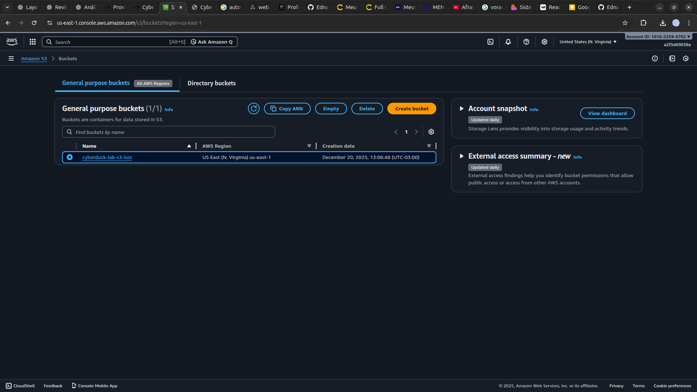

<h1 align=center> Cyberduck - Utilizando o Cyberduck no Windows para gerenciar arquivos do S3 </h1>

<h2> Amazon S3 </h2>

O Amazon S3 (Simple Storage Service) é um serviço de armazenamento de objetos altamente escalável, durável e seguro oferecido pela Amazon Web Services (AWS). Projetado para acomodar desde alguns gigabytes até exabytes de dados, o S3 é uma solução versátil para armazenamento na nuvem, adequada para uma variedade de casos de uso, incluindo backup, arquivamento, distribuição de conteúdo e hospedagem de sites. Além da escalabilidade e durabilidade, o S3 oferece recursos avançados, como controle de acesso granular, versões de objetos, transferência de dados criptografada e integração fácil com outros serviços da AWS, tornando-o uma escolha fundamental para o armazenamento e gerenciamento eficiente de dados na nuvem.

<h2> Cyberduck </h2>

O Cyberduck é um cliente robusto e intuitivo para transferência de arquivos, projetado para gerenciar conexões com servidores e serviços de armazenamento em nuvem. Compatível com sistemas operacionais Windows e macOS, ele suporta protocolos como FTP, SFTP, WebDAV, e integra-se com plataformas populares como Amazon S3, Google Drive, Dropbox, e Microsoft Azure. Com uma interface amigável, recursos avançados como edição de arquivos em tempo real e gerenciamento de permissões, o Cyberduck é ideal para usuários que precisam de uma solução confiável e versátil para transferir e organizar dados, tanto em ambientes pessoais quanto corporativos.

<h2> Conteúdo do laboratório </h2>

Neste laboratório você irá aprender a utilizar o Cyberduck para acessar e gerenciar o S3 no Windows.

<h2>Tarefas a serem executadas</h2>

1 - Crie um bucket do S3
2 - Instalar Cyberduck
3 - Configure o Cyberduck
4 - Gerenciar o Amazon S3 utilizando Cyberduck

<h2>Resultado</h2>

    

