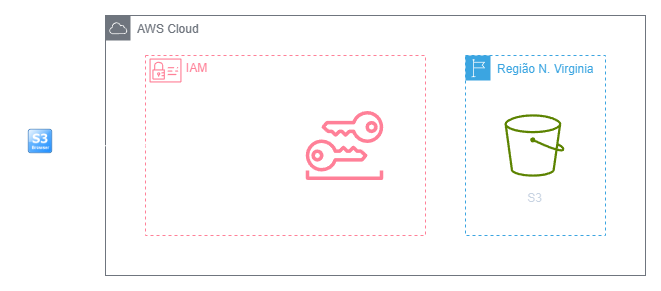
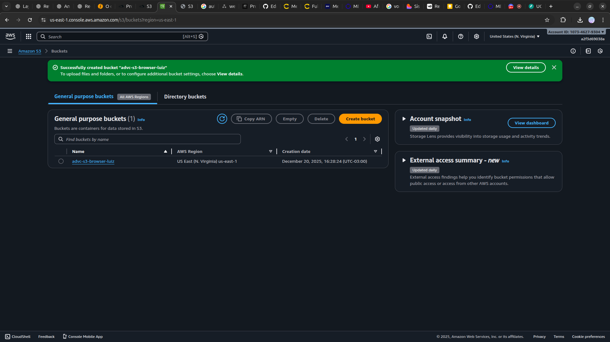

<h1 align=center> S3 Browser - Utilizando o S3 Browser para usar o S3 a partir do Windows </h1>

    

<h2> Amazon S3 </h2>

O Amazon S3 (Simple Storage Service) é um serviço de armazenamento de objetos altamente escalável, durável e seguro oferecido pela Amazon Web Services (AWS). Projetado para acomodar desde alguns gigabytes até exabytes de dados, o S3 é uma solução versátil para armazenamento na nuvem, adequada para uma variedade de casos de uso, incluindo backup, arquivamento, distribuição de conteúdo e hospedagem de sites. Além da escalabilidade e durabilidade, o S3 oferece recursos avançados, como controle de acesso granular, versões de objetos, transferência de dados criptografada e integração fácil com outros serviços da AWS, tornando-o uma escolha fundamental para o armazenamento e gerenciamento eficiente de dados na nuvem.

<h2> Conteúdo do laboratório </h2>

Neste laboratório você irá aprender a utilizar o S3 Browser para acessar o S3 no Windows.

<h2>Tarefas a serem executadas</h2>

1 - Crie um bucket do S3
2 - Instalar Browser S3
3 - Configurando ao Browser S3
4 - Gerenciar o Amazon S3 utilizando S3 Browser

<h2>Resultado</h2>

    

