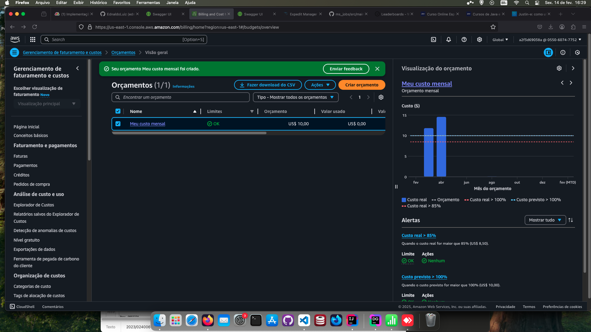
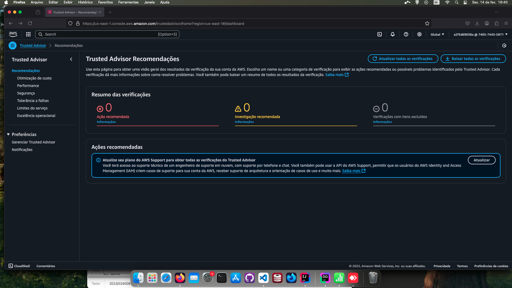

<h1 align=center> AWS Trusted Advisor - Conhecendo o serviço </h1>

    

<h2> Conteúdo do laboratório </h2>

O objetivo deste laboratório é conhecer a console do AWS Trusted Advisor e as suas funcionalidades.

<h2>Tarefas a serem executadas</h2>

1. Acesse a console de gerenciamento da AWS.
2. Acesse o AWS Trusted Advisor e conheça a console do mesmo.

<h2>Resultado</h2>

    

