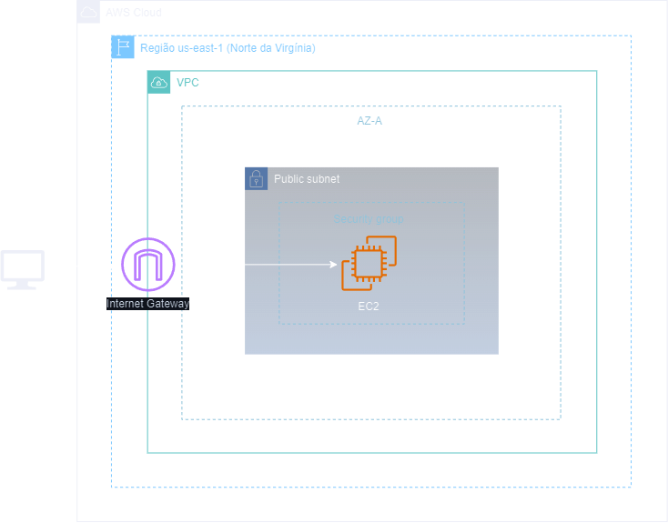
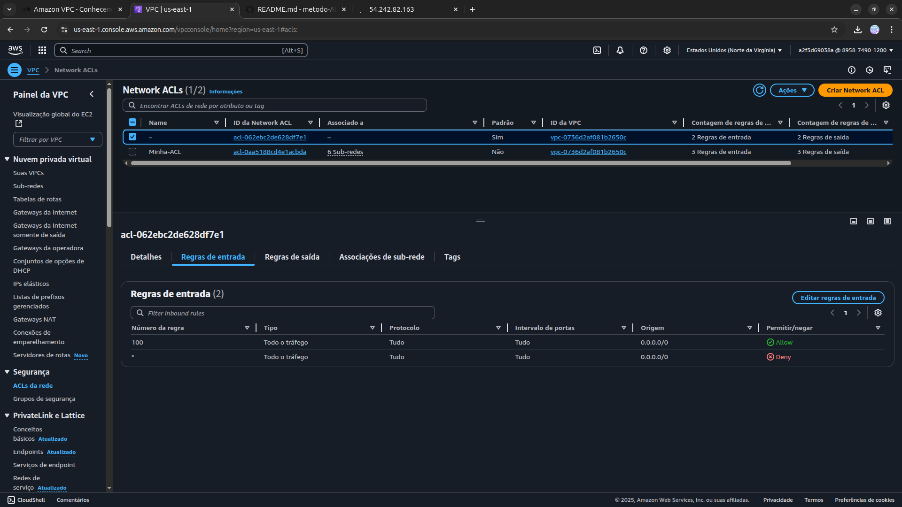

<h1 align=center> Amazon VPC - Conhecendo e configurando Security Group e Network ACL </h1>

<h2>Arquitetura do laboratório</h2>

    

<h2> Conteúdo do laboratório </h2>

Neste laboratório iremos aprender a trabalhar com grupos de segurança e Network ACL.

<h2>Tarefas a serem executadas</h2>

1. Acessar a Console de Gerenciamento da AWS.
2. Criar instâncias EC2.
3. Teste conexão da instância com a Internet via HTTP
4. Teste conexão da instância com a internet via ICMP
5. Liberar o acesso ICMP do grupo de segurança.
6. Criar ACLs personalizada.
7. Testar a liberação de ACL verificando a conexão da instância com a internet via HTTP.

<h2>Resultado</h2>

    

