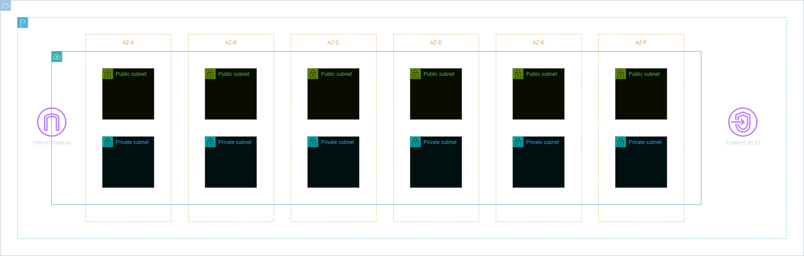
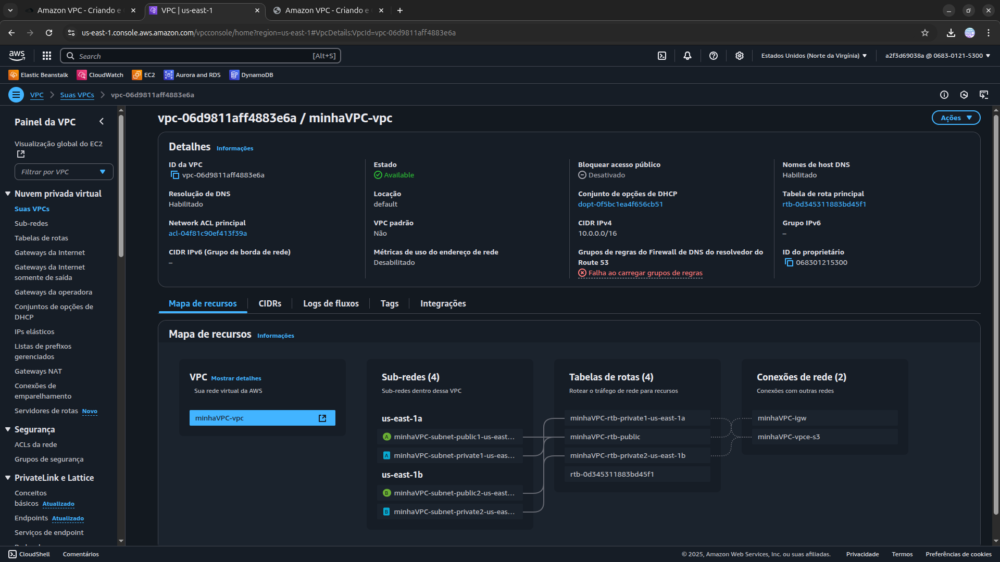

<h1 align=center> Amazon VPC - Criando e Configurando uma VPC com o VPC Wizard</h1>

<h2>Arquitetura do laboratório</h2>

    

<h2> Conteúdo do laboratório </h2>

Neste laboratório, você aprenderá a criar e configurar uma Virtual Private Cloud (VPC).

<h2>Tarefas a serem executadas</h2>

1. Acesse a console de gerenciamento da AWS.
2. Navegue até o serviço VPC.
3. Crie uma VPC.
4. Crie subnets.

<h2>Resultado</h2>

    

