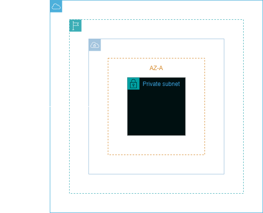
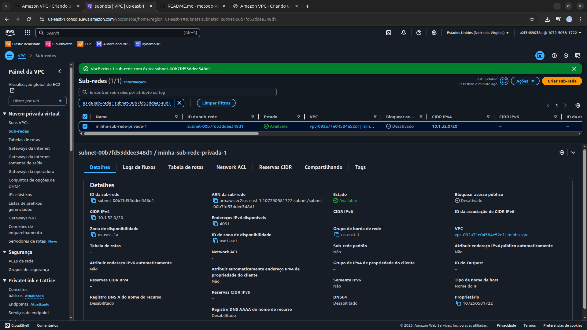

<h1 align=center> Amazon VPC - Criando uma subnet privada </h1>

<h2>Arquitetura do laboratório</h2>

    

<h2> Conteúdo do laboratório </h2>

Neste laboratório prático, aprenderemos a criar uma Subnet pública na Amazon Web Services (AWS). A Subnet pública é essencial para hospedar recursos que necessitam de conectividade direta com a Internet, como servidores web ou aplicativos de balanceamento de carga.

<h2>Tarefas a serem executadas</h2>

1. Acesse a console de gerenciamento da AWS.
2. Crie uma VPC.
3. Crie uma sub-rede privada.

<h2>Resultado</h2>

    

